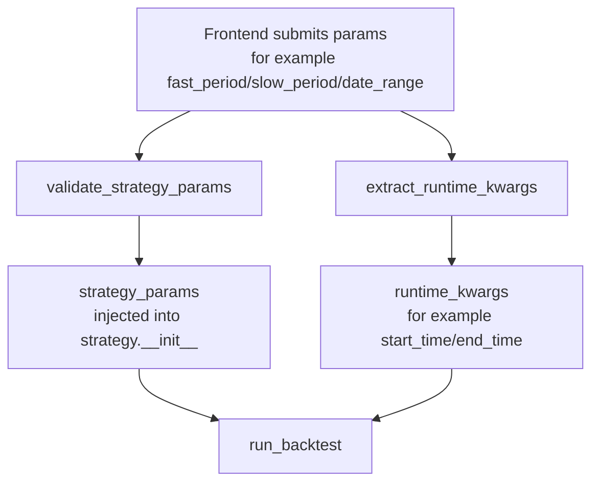

# Examples Collection

## 1. Basic Examples

*   [Examples Directory Index](https://github.com/akfamily/akquant/blob/main/examples/README.md): Quick entry to all scripts under `examples/`, including scenario-based shortest run paths.
*   [Quick Start](../start/quickstart.md): Complete workflow covering manual data backtesting and AKShare data backtesting.
*   [Simple SMA Strategy](strategy.md#class-based): Demonstrates how to write a strategy in class style and perform simple trading logic in `on_bar`.
*   [Shortest Path for Multi-Asset Target Weights](https://github.com/akfamily/akquant/blob/main/examples/43_target_weights_rebalance.py): TopN dynamic rebalance example using momentum ranking and one-shot portfolio adjustment.

> Data Source Convention: Unless otherwise specified (e.g. simulated data), examples on this page default to using AKShare to fetch real market data.

### UI-Driven Strategy Parameterization (PARAM_MODEL)

For UI/API integration scenarios, you can declare a strategy-side parameter model and keep optimization search space separate:

```python
from akquant import (
    IntParam,
    ParamModel,
    Strategy,
    get_strategy_param_schema,
    validate_strategy_params,
    run_grid_search,
)


class SmaParams(ParamModel):
    fast_period: int = IntParam(10, ge=2, le=200)
    slow_period: int = IntParam(30, ge=3, le=500)


class SmaStrategy(Strategy):
    PARAM_MODEL = SmaParams

    def __init__(self, fast_period: int = 10, slow_period: int = 30):
        self.fast_period = fast_period
        self.slow_period = slow_period


schema = get_strategy_param_schema(SmaStrategy)
validated = validate_strategy_params(
    SmaStrategy,
    {"fast_period": 12, "slow_period": 36},
)

results = run_grid_search(
    strategy=SmaStrategy,
    data=df,
    param_grid={"fast_period": [5, 10, 15], "slow_period": [20, 30, 60]},
)
```

### Parameter Routing Flow (frontend params -> backtest call)



Notes:

* `strategy_params` contains strategy construction parameters (strategy-logic related, such as MA periods).
* `runtime_kwargs` contains runtime backtest parameters (execution-window related, such as `start_time` and `end_time`).
* Current default mapping rule is `date_range -> start_time/end_time`.

### API Integration Example (HTTP)

1) Fetch schema (frontend uses it to render form fields):

```http
GET /api/strategies/sma_cross/schema
```

Example response:

```json
{
  "title": "SMACrossParams",
  "type": "object",
  "properties": {
    "fast_period": { "type": "integer", "default": 10, "minimum": 2, "maximum": 200 },
    "slow_period": { "type": "integer", "default": 30, "minimum": 3, "maximum": 500 },
    "date_range": {
      "type": "object",
      "properties": {
        "start": { "type": "string", "format": "date-time" },
        "end": { "type": "string", "format": "date-time" }
      }
    }
  }
}
```

2) Submit params and start backtest:

```http
POST /api/backtest
Content-Type: application/json
```

```json
{
  "strategy_id": "sma_cross",
  "params": {
    "fast_period": 12,
    "slow_period": 36,
    "date_range": {
      "start": "2023-01-01T00:00:00",
      "end": "2023-12-31T00:00:00"
    }
  }
}
```

Example response (showing parameter routing result):

```json
{
  "strategy_params": {
    "fast_period": 12,
    "slow_period": 36,
    "date_range": {
      "start": "2023-01-01T00:00:00",
      "end": "2023-12-31T00:00:00"
    }
  },
  "runtime_kwargs": {
    "start_time": "2023-01-01T00:00:00",
    "end_time": "2023-12-31T00:00:00"
  }
}
```

## 2. Advanced Examples

*   **Zipline Style Strategy**: Demonstrates how to write strategies using functional API (`initialize`, `on_bar`), suitable for users migrating from Zipline.
    *   Refer to [Strategy Guide](strategy.md#style-selection).

*   **Multi-Asset Backtest**:
    *   **Futures Strategy**: Demonstrates futures backtest configuration (margin, multiplier). Refer to [Strategy Guide](strategy.md#multi-asset).
    *   **Option Strategy**: Demonstrates option backtest configuration (premium, per contract fee). Refer to [Strategy Guide](strategy.md#multi-asset).

*   **Vectorized Indicators**:
    *   Demonstrates how to use `IndicatorSet` to pre-calculate indicators to improve backtest speed. Refer to [Strategy Guide](strategy.md#indicatorset).

### Fetching A-Share Daily Data with AKShare (stock_zh_a_daily)

```python
import akshare as ak
import pandas as pd
from akquant import run_backtest

df = ak.stock_zh_a_daily(symbol="sz000001", adjust="qfq")
if "date" not in df.columns:
    df = df.reset_index().rename(columns={"index": "date"})
df.columns = [c.lower() for c in df.columns]
if "time" in df.columns and "date" not in df.columns:
    df = df.rename(columns={"time": "date"})
df["date"] = pd.to_datetime(df["date"]).dt.tz_localize("Asia/Shanghai")
df["symbol"] = "000001"
cols = ["date", "open", "high", "low", "close", "volume", "symbol"]
df = df[cols].sort_values("date").reset_index(drop=True)

# result = run_backtest(data=df, strategy=DualSMAStrategy, lot_size=100)
```

## 3. Common Strategies

Here are some common quantitative strategy implementations that you can use directly in your projects. We provide detailed logic explanations for each strategy to help you understand the core concepts.

### 3.1 Dual Moving Average Strategy

[View Full Source](https://github.com/akfamily/akquant/blob/main/examples/strategies/01_stock_dual_moving_average.py)

**Core Concept**:
The Dual Moving Average strategy uses two moving averages (SMA) with different periods to determine market trends.

- **Golden Cross**: Short-term SMA crosses above Long-term SMA -> Buy.
- **Death Cross**: Short-term SMA crosses below Long-term SMA -> Sell.

**AKQuant Features**:

- Using `get_history` to fetch historical data (including current Bar).
- A-Share trading rules (1 lot = 100 shares).

```python
class DualMovingAverageStrategy(Strategy):
    def __init__(self, short_window=5, long_window=20):
        self.short_window = short_window
        self.long_window = long_window
        # Warmup period setting
        self.warmup_period = long_window

    def on_bar(self, bar):
        # Fetch historical data including current Bar
        closes = self.get_history(count=self.long_window, symbol=bar.symbol, field="close")

        if len(closes) < self.long_window:
            return

        # Calculate MAs
        short_ma = np.mean(closes[-self.short_window:])
        long_ma = np.mean(closes[-self.long_window:])

        current_pos = self.get_position(bar.symbol)

        # Golden Cross -> Buy
        if short_ma > long_ma and current_pos == 0:
            self.order_target_percent(symbol=bar.symbol, target_percent=0.95)

        # Death Cross -> Sell
        elif short_ma < long_ma and current_pos > 0:
            self.close_position(symbol=bar.symbol)
```

### 3.2 Grid Trading Strategy

[View Full Source](https://github.com/akfamily/akquant/blob/main/examples/strategies/02_stock_grid_trading.py)

**Core Concept**:
A mechanical trading strategy based on price fluctuations.

- **Buy Dip**: Buy a portion for every X% price drop.
- **Sell Rally**: Sell a portion for every X% price rise.
- **Suitable for**: Oscillating markets.

**AKQuant Features**:

- Managing custom state variables (`self.last_trade_price`) inside `on_bar`.
- Complex position management.

```python
class GridTradingStrategy(Strategy):
    def __init__(self, grid_pct=0.03, lot_size=100):
        self.grid_pct = grid_pct
        self.trade_lot = lot_size
        self.last_trade_price = {}

    def on_bar(self, bar):
        symbol = bar.symbol
        close = bar.close

        # Initial Position
        if symbol not in self.last_trade_price:
            self.buy(symbol=symbol, quantity=10 * self.trade_lot)
            self.last_trade_price[symbol] = close
            return

        last_price = self.last_trade_price[symbol]
        change_pct = (close - last_price) / last_price

        # Buy Dip
        if change_pct <= -self.grid_pct:
            self.buy(symbol=symbol, quantity=self.trade_lot)
            self.last_trade_price[symbol] = close

        # Sell Rally
        elif change_pct >= self.grid_pct:
            current_pos = self.get_position(symbol)
            if current_pos >= self.trade_lot:
                self.sell(symbol=symbol, quantity=self.trade_lot)
                self.last_trade_price[symbol] = close
```

### 3.3 ATR Breakout Strategy

[View Full Source](https://github.com/akfamily/akquant/blob/main/examples/strategies/03_stock_atr_breakout.py)

**Core Concept**:
Uses ATR (Average True Range) to build price channels and capture trend breakouts.

- **Upper Band**: Previous Close + k * ATR
- **Lower Band**: Previous Close - k * ATR
- **Breakout**: Price > Upper Band -> Buy.
- **Breakdown**: Price < Lower Band -> Sell.

**AKQuant Features**:

- **Avoiding Look-ahead Bias**: Use `get_history` and slice with `[:-1]` to exclude the current Bar, using strictly historical data to calculate today's breakout thresholds.

```python
class AtrBreakoutStrategy(Strategy):
    def __init__(self, period=20, k=2.0):
        self.period = period
        self.k = k
        self.warmup_period = period + 1

    def on_bar(self, bar):
        # Fetch N+1 data points
        req_count = self.period + 1
        h_closes = self.get_history(count=req_count, field="close")

        if len(h_closes) < req_count:
            return

        # Exclude current Bar (last element)
        closes = h_closes[:-1]

        # ... (ATR calculation logic) ...
        atr = calculate_atr(closes) # Pseudo-code

        # Calculate bands based on YESTERDAY's close
        prev_close = closes[-1]
        upper_band = prev_close + self.k * atr
        lower_band = prev_close - self.k * atr

        # Trading Logic
        if bar.close > upper_band:
            self.buy(quantity=500)
        elif bar.close < lower_band:
            self.close_position()
```

### 3.4 Momentum Rotation Strategy

[View Full Source](https://github.com/akfamily/akquant/blob/main/examples/strategies/04_stock_momentum_rotation.py)

**Core Concept**:
Hold the asset with the strongest recent momentum (return) among a pool of assets.

- Calculate momentum for candidates periodically (e.g., daily).
- Sell weak assets and buy the strongest one.

**AKQuant Features**:

- **Multi-Asset Data**: Passing `Dict[str, DataFrame]` to the engine.
- **Cross-Asset Comparison**: Iterating `self.symbols` and calling `get_history` for each.
- **Target Position**: Using `order_target_percent` for easy rotation.

```python
class MomentumRotationStrategy(Strategy):
    def __init__(self, lookback_period=20):
        self.lookback_period = lookback_period
        self.symbols = ["sh600519", "sz000858"] # Maotai vs Wuliangye
        self.warmup_period = lookback_period + 1

    def on_bar(self, bar):
        # Run rotation logic only once per day (on the last symbol)
        if bar.symbol != self.symbols[-1]:
            return

        # 1. Calculate Momentum
        momentums = {}
        for s in self.symbols:
            closes = self.get_history(count=self.lookback_period, symbol=s, field="close")
            # Momentum = (Current - Previous) / Previous
            mom = (closes[-1] - closes[0]) / closes[0]
            momentums[s] = mom

        # 2. Select Best
        best_symbol = max(momentums, key=momentums.get)

        # 3. Rotate
        current_pos_symbol = self.get_current_holding_symbol() # Pseudo-code

        if current_pos_symbol != best_symbol:
            if current_pos_symbol:
                self.close_position(current_pos_symbol)
            # Target 95% position
            self.order_target_percent(target_percent=0.95, symbol=best_symbol)
```

### 3.5 Use Adjusted Series for Signals, Real Prices for Execution

When your data provides `adj_close` or `adj_factor`, you can fetch adjusted series directly via `get_history(symbol=..., field="adj_close", n)` for signal computation, while matching and valuation still use real `close`. See `examples/16_adj_returns_signal.py`.

```python
class AdjSignal(Strategy):
    warmup_period = 5
    def on_bar(self, bar):
        try:
            x = self.get_history(2, bar.symbol, "adj_close")
        except Exception:
            return
        if x is None or len(x) < 2:
            return
        r = x[-1] / x[-2] - 1.0
        pos = self.get_position(bar.symbol)
        if pos == 0 and r > 0:
            self.buy(bar.symbol, 100)
        elif pos > 0 and r < 0:
            self.close_position(bar.symbol)
```

## 4. Other AKShare Examples

The `examples/` directory contains more scripts demonstrating AKShare integration:

*   **[11_plot_visualization.py](https://github.com/akfamily/akquant/blob/main/examples/11_plot_visualization.py)**:
    *   Complete workflow: Fetch data -> Backtest -> Visualize.
    *   Demonstrates how to generate professional HTML reports.

*   **[14_multi_frequency.py](https://github.com/akfamily/akquant/blob/main/examples/14_multi_frequency.py)**:
    *   **Mixed Frequency**: Combining Daily (for trend) and Minute (for execution) data.
    *   Note: Uses synthetic minute data derived from AKShare daily data for demonstration.

*   **[15_plot_intraday.py](https://github.com/akfamily/akquant/blob/main/examples/15_plot_intraday.py)**:
    *   **Intraday Simulation**: Generates synthetic minute-level data from AKShare daily data.
    *   Demonstrates high-frequency backtesting capabilities.

*   **[17_readme_demo.py](https://github.com/akfamily/akquant/blob/main/examples/17_readme_demo.py)**:
    *   A simple, standalone script for the README demonstration.
    *   Good for a quick "Hello World" test.

*   **[22_strategy_runtime_config_demo.py](https://github.com/akfamily/akquant/blob/main/examples/22_strategy_runtime_config_demo.py)**:
    *   Demonstrates `strategy_runtime_config`, `runtime_config_override`, and warm-start injection.
    *   Shows conflict warning deduplication with repeated runs on the same strategy instance.
    *   Expected output markers include `scenario1_done`, `scenario2_exception=...`, `scenario3_done`.

*   **[23_functional_callbacks_demo.py](https://github.com/akfamily/akquant/blob/main/examples/23_functional_callbacks_demo.py)**:
    *   Demonstrates function-style callbacks with `initialize`, `on_bar`, and optional `on_order` / `on_trade` / `on_timer`.
    *   Prints callback counters and ends with `done_functional_callbacks_demo`.

*   **[24_functional_tick_simulation_demo.py](https://github.com/akfamily/akquant/blob/main/examples/24_functional_tick_simulation_demo.py)**:
    *   Demonstrates function-style `on_tick` callback triggering via simulated tick event dispatch.
    *   Prints tick/order/trade/timer counters and ends with `done_functional_tick_simulation_demo`.

*   **[25_streaming_backtest_demo.py](https://github.com/akfamily/akquant/blob/main/examples/25_streaming_backtest_demo.py)**:
    *   Demonstrates `run_backtest(..., on_event=...)` behavior under both `stream_error_mode="continue"` and `"fail_fast"`.
    *   Prints `continue_callback_error_count`, `fail_fast_exception=...`, and ends with `done_streaming_backtest_demo`.

*   **[26_streaming_quickstart.py](https://github.com/akfamily/akquant/blob/main/examples/26_streaming_quickstart.py)**:
    *   Provides a stream-style counterpart of `01_quickstart.py` using `run_backtest(..., on_event=...)`.
    *   Prints `stream_started`, `stream_finished`, `stream_seq_monotonic`, and ends with `done_streaming_quickstart`.

*   **[27_streaming_monitoring_console.py](https://github.com/akfamily/akquant/blob/main/examples/27_streaming_monitoring_console.py)**:
    *   Demonstrates realtime monitoring for parameter-set runs using `run_backtest(..., on_event=...)`, with `progress/order/trade/finished` event aggregation.
    *   Prints per-config event counters and return summaries, then ends with `done_streaming_monitoring_console`.

*   **[28_streaming_alerts_and_persist.py](https://github.com/akfamily/akquant/blob/main/examples/28_streaming_alerts_and_persist.py)**:
    *   Demonstrates stream alerting and persistence: computes drawdown on `equity` events and emits threshold alerts while writing event snapshots to CSV.
    *   Prints `max_drawdown_seen`, `event_csv=...`, and ends with `done_streaming_alerts_and_persist`.

*   **[29_streaming_event_report.py](https://github.com/akfamily/akquant/blob/main/examples/29_streaming_event_report.py)**:
    *   Reads the CSV generated by `28_streaming_alerts_and_persist.py` and builds an interactive HTML report (cumulative event curves + distribution).
    *   Prints `report_html=...` and ends with `done_streaming_event_report`.

*   **[30_streaming_report_oneclick.py](https://github.com/akfamily/akquant/blob/main/examples/30_streaming_report_oneclick.py)**:
    *   One-click chain for 28 + 29: generates event CSV, builds the HTML report, and can auto-open the browser.
    *   Supports `--no-open`, `--serve`, `--port`, and `--serve-seconds`, then prints `done_streaming_report_oneclick` as the end marker.

*   **[31_streaming_live_console.py](https://github.com/akfamily/akquant/blob/main/examples/31_streaming_live_console.py)**:
    *   Demonstrates true "see while running" behavior: renders a live terminal sparkline from `equity` events and emits alert messages on drawdown threshold breach.
    *   Prints `total_return`, `max_drawdown_live`, and ends with `done_streaming_live_console`.

*   **[32_streaming_live_web.py](https://github.com/akfamily/akquant/blob/main/examples/32_streaming_live_web.py)**:
    *   Demonstrates visible live backtesting in browser: polls streaming state, draws a dynamic equity chart, and shows alerts and progress in realtime.
    *   Supports `--port`, `--open`, `--sleep-ms`, and `--keep-seconds`, and ends with `done_streaming_live_web`.

*   **[33_report_and_analysis_outputs.py](https://github.com/akfamily/akquant/blob/main/examples/33_report_and_analysis_outputs.py)**:
    *   Demonstrates post-backtest one-stop outputs: generates an interactive report and prints row-count summaries of `exposure_df` / `attribution_df` / `capacity_df` and strategy-level summaries via `orders_by_strategy` / `executions_by_strategy`.
    *   Prints `report_html=...` and ends with `done_report_and_analysis_outputs`.

*   **[34_multi_strategy_demo.py](https://github.com/akfamily/akquant/blob/main/examples/34_multi_strategy_demo.py)**:
    *   Demonstrates multi-slot strategy organization using centralized `BacktestConfig(strategy_config=StrategyConfig(...))`.
    *   Covers strategy-level limits, reduce-only behavior, and cooldown bars under the config-driven style.
    *   Prints `single_owner_ids`, `multi_owner_ids`, `multi_alpha_cooldown_rejections`, and ends with `done_multi_strategy_demo`.

*   **[35_custom_broker_registry_demo.py](https://github.com/akfamily/akquant/blob/main/examples/35_custom_broker_registry_demo.py)**:
    *   Demonstrates custom broker registry flow: injects a broker `builder` with `register_broker` and creates gateways by name via `create_gateway_bundle`.
    *   Prints `bundle.metadata` to confirm the custom broker is resolved by factory.

*   **[43_target_weights_rebalance.py](https://github.com/akfamily/akquant/blob/main/examples/43_target_weights_rebalance.py)**:
    *   Demonstrates TopN dynamic weights: rank symbols by momentum, select winners, then rebalance with `order_target_weights`.
    *   Shows practical usage of `liquidate_unmentioned` and `rebalance_tolerance`, then prints `selected_history` / `final_positions` / `final_equity`.
