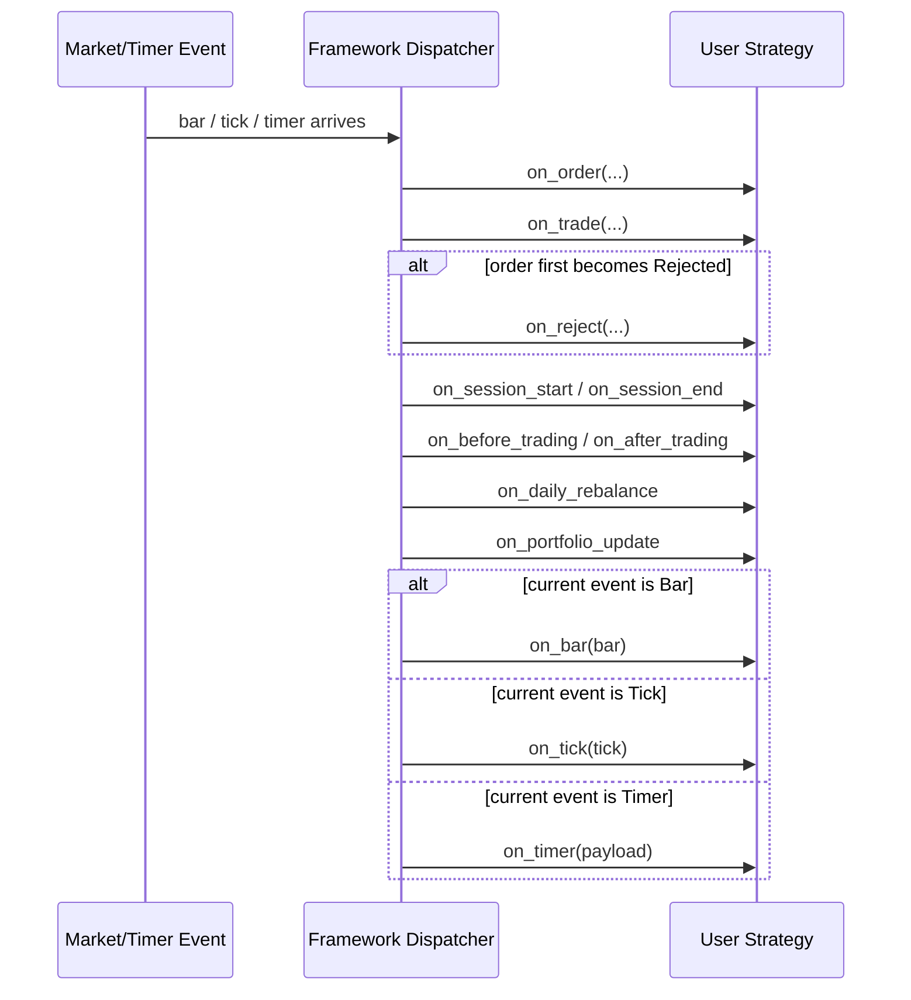
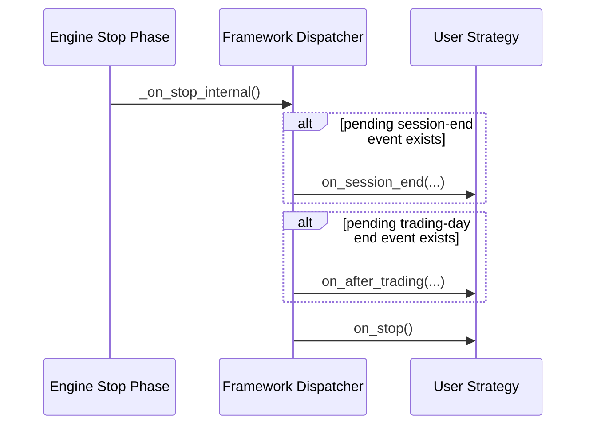

# Strategy Guide

This document aims to help strategy developers quickly master how to write strategies in AKQuant.

## 1. Core Concepts (Glossary)

For those new to quantitative trading, here are some basic terms:

*   **Bar (Candlestick)**: Contains market data for a specific time period (e.g., 1 minute, 1 day), primarily including 5 data points:
    *   **Open**: Opening price
    *   **High**: Highest price
    *   **Low**: Lowest price
    *   **Close**: Closing price
    *   **Volume**: Trading volume
*   **Strategy**: Your trading robot. Its core job is to continuously watch the market (`on_bar`) and then decide whether to `buy` or `sell`.
*   **Context**: The robot's "notebook" and "toolbox". It records how much cash and how many positions are currently held, and provides tools for placing orders.
*   **Position**: The quantity of stocks or futures you currently hold. A positive number indicates a long position (buying to hold), and a negative number indicates a short position (selling borrowed securities).
*   **Backtest**: Historical simulation. Testing your strategy using past data to see how much money it would have made if executed in the past.

## 2. Strategy Lifecycle

A strategy goes through the following stages from start to finish:

*   `__init__`: Python object initialization, suitable for defining parameters.
*   `on_start`: Called when the strategy starts. You **must** use `self.subscribe()` here to subscribe to data, and you can also register indicators here.
*   `on_bar`: Triggered when each Bar closes (core trading logic).
*   `on_tick`: Triggered when each Tick arrives (high-frequency/order book strategies).
*   `on_order`: Triggered when order status changes (e.g., Submitted, Filled, Cancelled).
*   `on_trade`: Triggered when a trade execution report is received.
*   `on_reject`: Triggered when an order enters `Rejected` status.
*   `on_session_start` / `on_session_end`: Triggered on session transitions.
*   `on_before_trading` / `on_after_trading`: Daily trading hooks.
*   `on_pre_open`: The last valid decision point before the open, for "pre-open signal, current open fill" workflows.
*   `on_portfolio_update`: Triggered when portfolio snapshot changes.
*   `on_error`: Triggered when user callback raises an exception, then exception is re-raised by default.
*   `on_timer`: Called when a timer triggers (needs manual registration).
    > Recommended: Use `self.add_daily_timer("14:55:00", "payload")`.
*   `on_stop`: Called when the strategy stops, suitable for resource cleanup or result statistics (refer to Backtrader `stop` / Nautilus `on_stop`).
*   `on_train_signal`: Triggered for rolling training signals (only in ML mode).

### 2.0 Callback Cheat Sheet

| Callback | Trigger timing | Typical usage | Example |
| :--- | :--- | :--- | :--- |
| `on_start` | After strategy instance is started | Subscribe symbols, register indicators, initialize runtime state | `examples/textbook/ch05_strategy.py` |
| `on_resume` | On warm-start restore, before `on_start` | Restore connections, inspect restored state, continue from snapshot | `examples/21_warm_start_demo.py` |
| `on_bar` | When each bar closes | Main trading logic, indicator updates, signal generation | `examples/01_quickstart.py` |
| `on_tick` | When each tick arrives | High-frequency reactions, tick-level monitoring | `examples/51_class_tick_callbacks_demo.py` |
| `on_order` | When order status changes | Track lifecycle, reset state, order-linked orchestration | `examples/08_event_callbacks.py` |
| `on_trade` | When a trade report arrives | Execution logging, post-trade risk handling, aggregation | `examples/08_event_callbacks.py` |
| `on_reject` | First time an order becomes `Rejected` | Log reject reasons, alerting, graceful degradation | `examples/50_framework_hooks_demo.py` |
| `on_session_start` | When session transition begins | Reset day/night session state, session-aware bookkeeping | `examples/50_framework_hooks_demo.py` |
| `on_session_end` | When session transition ends | End-of-session cleanup and logging | `examples/50_framework_hooks_demo.py` |
| `on_before_trading` | First entry into `Normal` session each local trading day | Pre-market checks, trading-date level signal preparation | `examples/50_framework_hooks_demo.py` |
| `on_pre_open` | Triggered by a framework timer before the first regular event of each trading day | Auction/pre-open signal generation with default next-open order semantics | `examples/52_pre_open_demo.py` |
| `on_daily_rebalance` | At most once per trading day, same phase as `on_before_trading` | Cross-sectional ranking and one-shot rebalance | `examples/strategies/05_stock_momentum_rotation_timer.py` |
| `on_after_trading` | When leaving `Normal`, or replayed on the next event if needed | End-of-day summaries, post-close cleanup, archiving | `examples/50_framework_hooks_demo.py` |
| `on_portfolio_update` | Incrementally when portfolio snapshot changes | Monitor cash/equity changes, push UI or alerts | `examples/50_framework_hooks_demo.py` |
| `on_error` | When any user callback raises | Record callback source and choose continue vs fail-fast | `examples/22_strategy_runtime_config_demo.py` |
| `on_timer` | When a registered timer fires | Scheduled rebalance, pre-market tasks, cadence checks | `examples/strategies/07_stock_momentum_rotation_on_timer.py` |
| `on_stop` | When strategy stops | Final summary, resource cleanup, reporting | `examples/textbook/ch05_strategy.py` |
| `on_expiry` | After expiry settlement/removal is actually executed | Roll contracts, record settlement, clear expired instruments | `examples/49_on_expiry_demo.py` |
| `on_train_signal` | When ML rolling training window is triggered | Train models and swap pending model versions | `examples/10_ml_walk_forward.py` |

For framework-level hooks such as `on_session_start`, `on_session_end`, `on_before_trading`, `on_after_trading`, `on_portfolio_update`, and `on_reject`, start with `examples/50_framework_hooks_demo.py` to observe trigger order and logs in one place.
If your use case is "decide before the open, but still fill on this session's open", start with `examples/52_pre_open_demo.py` instead of trying to emulate it with a generic `on_timer`.
If you want a single "most common callbacks" script first, start with `examples/08_event_callbacks.py`; it bundles `on_start/on_bar/on_order/on_trade/on_reject/on_timer/on_portfolio_update/on_stop` in one place.
For class-style Tick strategies, start with `examples/51_class_tick_callbacks_demo.py`; if you prefer function-style callbacks, then continue with `examples/24_functional_tick_simulation_demo.py`.

### 2.1 Callback Dispatch Contract

For each `bar/tick/timer` event, AKQuant dispatches callbacks in this order:

1. `on_order` / `on_trade` (plus `on_reject` when status is `Rejected`)
2. Framework hooks (`on_session_*`, `on_before_trading`/`on_after_trading`, `on_portfolio_update`)
3. User event callback (`on_bar` / `on_tick` / `on_timer`)

Notes:

* `on_reject` is emitted once per order id when the order first becomes `Rejected`.
* `on_pre_open` is emitted once per trading day before the first regular bar/tick callback of that day.
* `on_before_trading` is emitted once per local trading date when session enters `Normal`.
* `on_after_trading` is emitted once per local trading date when leaving `Normal`, or on next event if day rollover occurs first.
* Inside `on_pre_open`, plain `buy/sell/order_target_*` calls automatically resolve to `price_basis=open, bar_offset=1, temporal=same_cycle` unless an explicit `fill_policy` is provided.
* Set `self.enable_precise_day_boundary_hooks = True` to enable boundary-timer based precise day hooks.
* `on_portfolio_update` is incremental: emitted once at initialization, then only on order/trade or position-relevant price changes.
* Use `self.portfolio_update_eps` to filter tiny equity/cash changes (default `0.0`).
* During stop phase, pending `on_session_end` / `on_after_trading` are flushed before `on_stop`.
* `on_error` receives `(error, source, payload)`. Prefer `self.error_mode = "raise" | "continue"` (default `raise`). `self.re_raise_on_error` remains as fallback for compatibility.
* Prefer `self.runtime_config = StrategyRuntimeConfig(...)` as a unified runtime switch entry.
* Legacy alias fields and `runtime_config` stay synchronized automatically.

#### 2.1.1 Regular Event Dispatch Sequence



#### 2.1.2 Stop-Phase Flush Sequence



#### 2.1.3 When To Use `on_pre_open`

Use `on_pre_open` when:

* You produce signals from auction data, pre-open scans, or final checks right before the open.
* You want default order semantics to mean "fill on this session's open" without exposing a generic `open + 0` mode.
* You want a semantic callback that clearly communicates intent to other strategy authors.

Do not use a generic `on_timer` as a substitute when:

* The strategy meaning is specifically "pre-open signal, current open fill".
* You want the framework to preserve this execution intent explicitly.

Roles of nearby hooks:

* `on_before_trading`: trading-day semantic hook, focused on "the day has started".
* `on_pre_open`: execution semantic hook, focused on "last chance before the open".
* `on_timer`: generic scheduler for cadence tasks, not a dedicated open-fill abstraction.

Recommended template:

```python
class AuctionSignalStrategy(Strategy):
    def __init__(self) -> None:
        self.pending_dates = set()

    def on_start(self) -> None:
        self.subscribe("000001")

    def on_pre_open(self, event: dict[str, object]) -> None:
        trading_date = event["trading_date"]
        if trading_date in self.pending_dates:
            return

        self.pending_dates.add(trading_date)

        signal = self.compute_pre_open_signal()
        if signal > 0:
            # Without an explicit fill_policy, this defaults to current-open semantics.
            self.buy("000001", quantity=100)
        elif signal < 0:
            self.sell("000001", quantity=100)
```

Practical tips:

* Keep `on_pre_open` focused on the final decision and order submission.
* You can prepare scans, candidate lists, and risk checks earlier, but leave the final open-fill decision to `on_pre_open`.
* If you pass an explicit `fill_policy`, the explicit policy wins.

Timing note:

* Do not treat `on_before_trading` as a stable same-day preparation stage that always runs before `on_pre_open`.
* On the default path, `on_pre_open` runs before the first regular event, while `on_before_trading` is usually emitted on that first regular event after the session enters `Normal`.
* Even with `enable_precise_day_boundary_hooks`, the boundary-timer version of `on_before_trading` should not be used as a deterministic same-day predecessor for `on_pre_open`.
* For a true two-stage pattern, prepare in a later callback from the previous trading day and execute in the next trading day's `on_pre_open`, for example via a previous-day `on_timer` or `on_after_trading`.
* See `examples/53_timer_to_pre_open_demo.py`.

## 3. Utilities

AKQuant provides a set of utilities to simplify strategy development.

### 3.1 Logging

Use `self.log()` to output logs with the current **backtest timestamp**, which is useful for debugging.

```python
def on_bar(self, bar):
    # Automatically adds timestamp, e.g., [2023-01-01 09:30:00] Signal: Buy
    self.log("Signal: Buy")

    # Support logging level
    import logging
    self.log("Insufficient funds", level=logging.WARNING)
```

### 3.2 Data Access (Syntactic Sugar)

The `Strategy` class provides properties for quick access to current Bar/Tick data:

| Property | Description | Original Code |
| :--- | :--- | :--- |
| `self.symbol` | Current symbol | `bar.symbol` / `tick.symbol` |
| `self.close` | Current price | `bar.close` / `tick.price` |
| `self.open` | Current open price | `bar.open` (0 in Tick mode) |
| `self.high` | Current high price | `bar.high` (0 in Tick mode) |
| `self.low` | Current low price | `bar.low` (0 in Tick mode) |
| `self.volume` | Current volume | `bar.volume` / `tick.volume` |

**Example**:
```python
def on_bar(self, bar):
    # Old way
    if bar.close > bar.open: ...

    # New way (Cleaner)
    if self.close > self.open:
        self.buy(self.symbol, 100)
```

### 3.3 Timer

In addition to the low-level `schedule` method, AKQuant provides more convenient ways to register timers:

*   **`add_daily_timer(time_str, payload)`**: Triggers daily at a specified time.
    *   **Live Mode Supported**: Pre-generates triggers in Backtest mode; Automatically schedules the next trigger daily in Live mode.
*   **`schedule(trigger_time, payload)`**: Triggers once at a specified datetime.

```python
def on_start(self):
    # Daily check at 14:55:00
    self.add_daily_timer("14:55:00", "daily_check")

    # Specific event
    self.schedule("2023-01-01 09:30:00", "special_event")

def on_timer(self, payload):
    if payload == "daily_check":
        self.log("Running daily check...")
```

### 3.4 Recommended Cross-Section Pattern

AKQuant triggers `on_bar` in single-event flow. For cross-sectional tasks such as rotation, ranking, and scoring across symbols, place decision logic in `on_timer`.

Recommended flow:

1. Define the `universe` in `on_start` and register a daily timer.
2. Compute cross-sectional scores in `on_timer`.
3. Rebalance in `on_timer` so each decision timestamp runs once.

```python
class CrossSectionStrategy(Strategy):
    def __init__(self, lookback=20):
        self.lookback = lookback
        self.universe = ["sh600519", "sz000858", "sh601318"]
        self.warmup_period = lookback + 1

    def on_start(self):
        self.add_daily_timer("14:55:00", "rebalance")

    def on_timer(self, payload):
        if payload != "rebalance":
            return
        scores = {}
        for symbol in self.universe:
            closes = self.get_history(count=self.lookback, symbol=symbol, field="close")
            if len(closes) < self.lookback:
                return
            scores[symbol] = (closes[-1] - closes[0]) / closes[0]
        best = max(scores, key=scores.get)
        self.order_target_percent(target_percent=0.95, symbol=best)
```

Full runnable sample: `examples/strategies/05_stock_momentum_rotation_timer.py`.

### 3.5 Cross-Section Plan B: Execute After Collecting One Timestamp

If your strategy has no fixed rebalance time and `on_timer` is not convenient, collect symbols by timestamp in `on_bar`, then run cross-sectional logic once when the slice is complete.

```python
from collections import defaultdict

class CrossSectionBucketStrategy(Strategy):
    def __init__(self, lookback=20):
        self.lookback = lookback
        self.universe = ["sh600519", "sz000858", "sh601318"]
        self.warmup_period = lookback + 1
        self.pending = defaultdict(set)

    def on_bar(self, bar):
        self.pending[bar.timestamp].add(bar.symbol)
        if len(self.pending[bar.timestamp]) < len(self.universe):
            return
        self.pending.pop(bar.timestamp, None)
        scores = {}
        for symbol in self.universe:
            closes = self.get_history(count=self.lookback, symbol=symbol, field="close")
            if len(closes) < self.lookback:
                return
            scores[symbol] = (closes[-1] - closes[0]) / closes[0]
        best = max(scores, key=lambda s: scores[s])
        self.order_target_percent(target_percent=0.95, symbol=best)
```

Full runnable sample: `examples/strategies/06_stock_momentum_rotation_bucket.py`.

### 3.6 Decision Matrix (A vs B)

| Dimension | Plan A: Unified `on_timer` | Plan B: Execute after timestamp completion |
| :--- | :--- | :--- |
| Trigger | Fixed rebalance time (e.g., 14:55) | Event-driven, when one slice is complete |
| Robustness | High, independent from symbol arrival order | Medium, needs buffering and missing-symbol handling |
| Complexity | Low, centralized decision path | Medium, requires `timestamp -> symbols` state |
| Best for | Daily/timed rebalances, production default | Cross-section without stable rebalance time |
| Common risk | Timer time not aligned with data frequency | Missing symbols can prevent trigger |

Recommendation: use Plan A by default; use Plan B only when a stable rebalance time cannot be defined.

### 3.7 Cross-Section Pitfall Checklist

*   **Suspensions / missing bars**: Plan B may not trigger if some symbols have no bar at a timestamp; add timeout fallback or minimum-valid-sample execution.
*   **Universe drift**: If constituents change but your universe list is stale, weights and ranks diverge from target; refresh periodically and track effective date.
*   **Rebalance time vs fill policy mismatch**: With `fill_policy={"price_basis":"open","bar_offset":1}`, close-time signals are filled on the next bar; use `fill_policy.temporal` to make timer fill timing explicit.
*   **Insufficient history windows**: Newly listed or recently resumed symbols may fail window requirements; check `len(closes)` and skip invalid samples.
*   **Position convergence lag**: Multi-asset sell-then-buy cycles can leave partial allocations in one event; use target-position APIs and converge again on next cycle.

For full pre-live checks, see: [Cross-Section Strategy Playbook Checklist](cross_section_checklist.md).

## 4. Choosing a Strategy Style {: #style-selection }

AKQuant provides two styles of strategy development interfaces:

For style selection guidance, see [Strategy Style Decision Guide](../advanced/strategy_style_decision.md).

| Feature | Class-based Style (Recommended) | Function-based Style |
| :--- | :--- | :--- |
| **Definition** | Inherit from `akquant.Strategy` | Define `initialize` + `on_bar` (required), optional `on_start` / `on_stop` / `on_tick` / `on_order` / `on_trade` / `on_timer` |
| **Scenarios** | Complex strategies, need to maintain internal state, production | Rapid prototyping, migrating Zipline/Backtrader strategies |
| **Structure** | Object-oriented, good logic encapsulation | Script-like, simple and intuitive |
| **API Call** | `self.buy()`, `self.ctx` | `ctx.buy()`, pass `ctx` as parameter |

### 4.1 Function-style Callback Trigger Conditions

| Callback | Trigger Condition | Notes |
| :--- | :--- | :--- |
| `on_bar(ctx, bar)` | Backtest feed emits Bar events | Required entry callback for function-style strategies |
| `on_start(ctx)` | Backtest starts | Aligns with class-style `on_start` lifecycle |
| `on_stop(ctx)` | Backtest ends | Aligns with class-style `on_stop` lifecycle |
| `on_tick(ctx, tick)` | Backtest feed emits Tick events | Tick callbacks are not triggered in bar-only datasets |
| `on_order(ctx, order)` | Order state changes are observed in strategy context | Triggered before event callback in each event loop |
| `on_trade(ctx, trade)` | Trade reports appear in `recent_trades` | Trade dedupe applies to avoid repeated callbacks |
| `on_timer(ctx, payload)` | A timer is scheduled and fired | Includes both one-shot and daily timer payloads |

### 4.2 Class vs Function Callback Mapping

| Class-based | Function-style | Notes | Recommended Example |
| :--- | :--- | :--- | :--- |
| `on_start(self)` | `on_start(ctx)` | Lifecycle entry point, supported by both styles | `examples/08_event_callbacks.py`, `examples/23_functional_callbacks_demo.py` |
| `on_stop(self)` | `on_stop(ctx)` | Lifecycle exit point, supported by both styles | `examples/textbook/ch05_strategy.py` |
| `on_bar(self, bar)` | `on_bar(ctx, bar)` | Primary strategy entry, supported by both styles | `examples/01_quickstart.py`, `examples/23_functional_callbacks_demo.py` |
| `on_tick(self, tick)` | `on_tick(ctx, tick)` | Tick entry, supported by both styles | `examples/51_class_tick_callbacks_demo.py`, `examples/24_functional_tick_simulation_demo.py` |
| `on_order(self, order)` | `on_order(ctx, order)` | Order state callback, supported by both styles | `examples/08_event_callbacks.py` |
| `on_trade(self, trade)` | `on_trade(ctx, trade)` | Trade report callback, supported by both styles | `examples/08_event_callbacks.py` |
| `on_expiry(self, event)` | `on_expiry(ctx, event)` | Expiry settlement callback, supported by both styles | `examples/49_on_expiry_demo.py` |
| `on_timer(self, payload)` | `on_timer(ctx, payload)` | Timer callback, supported by both styles | `examples/08_event_callbacks.py`, `examples/23_functional_callbacks_demo.py` |
| `on_resume(self)` | Not supported | Warm-start restore hook, currently class-style only | `examples/21_warm_start_demo.py` |
| `on_reject(self, order)` | Not supported | Reject callback, currently class-style only | `examples/08_event_callbacks.py`, `examples/50_framework_hooks_demo.py` |
| `on_session_start(self, session, timestamp)` | Not supported | Session boundary hook, currently class-style only | `examples/50_framework_hooks_demo.py` |
| `on_session_end(self, session, timestamp)` | Not supported | Session boundary hook, currently class-style only | `examples/50_framework_hooks_demo.py` |
| `on_before_trading(self, trading_date, timestamp)` | Not supported | Trading-day boundary hook, currently class-style only | `examples/50_framework_hooks_demo.py` |
| `on_after_trading(self, trading_date, timestamp)` | Not supported | Trading-day boundary hook, currently class-style only | `examples/50_framework_hooks_demo.py` |
| `on_daily_rebalance(self, trading_date, timestamp)` | Not supported | Daily rebalance hook, currently class-style only | `examples/strategies/05_stock_momentum_rotation_timer.py` |
| `on_portfolio_update(self, snapshot)` | Not supported | Portfolio snapshot callback, currently class-style only | `examples/50_framework_hooks_demo.py` |
| `on_error(self, error, source, payload)` | Not supported | User exception callback, currently class-style only | `examples/22_strategy_runtime_config_demo.py` |
| `on_train_signal(self, context)` | Not supported | ML rolling-train hook, currently class-style only | `examples/10_ml_walk_forward.py` |

Recommendations:

*   Choose class-based style when you need framework hooks such as `on_session_*`, `on_before_trading`, `on_after_trading`, `on_portfolio_update`, or `on_error`.
*   Choose function-style when you mainly need `on_bar/on_tick/on_order/on_trade/on_timer` for fast prototyping.

### 4.3 Related Examples

*   Function-style callback baseline: `examples/23_functional_callbacks_demo.py`
*   Function-style tick callback simulation: `examples/24_functional_tick_simulation_demo.py`
*   LiveRunner supports function-style entry and multi-slot orchestration: `LiveRunner(strategy_cls=on_bar, strategy_id="alpha", strategies_by_slot={"beta": OtherStrategy}, initialize=..., on_tick=..., on_order=..., on_trade=..., on_timer=...)`
*   For backtest multi-slot and strategy-level risk mapping, prefer centralized `BacktestConfig(strategy_config=StrategyConfig(...))`: `docs/en/advanced/multi_strategy_guide.md`
*   broker_live function-style submit example: `examples/39_live_broker_submit_order_demo.py`
*   Function-style multi-slot + risk example: `examples/40_functional_multi_slot_risk_demo.py`
*   LiveRunner multi-slot orchestration example: `examples/41_live_multi_slot_orchestration_demo.py`
*   Output markers:
    *   `done_functional_callbacks_demo`
    *   `done_functional_tick_simulation_demo`

## 4. Writing Class-based Strategies {: #class-based }

This is the recommended way to write strategies in AKQuant, offering a clear structure and easy extensibility.

```python
from akquant import Strategy, Bar
import numpy as np

class MyStrategy(Strategy):
    def __init__(self, ma_window=20):
        # Note: The Strategy class uses __new__ for initialization, subclasses do not need to call super().__init__()
        self.ma_window = ma_window

    def on_start(self):
        # Explicitly subscribe to data
        self.subscribe("600000")

    def on_bar(self, bar: Bar):
        # 1. Get historical data (Online mode)
        # Get the last N closing prices
        history = self.get_history(count=self.ma_window, symbol=bar.symbol, field="close")

        # Check if data is sufficient
        if len(history) < self.ma_window:
            return

        # Calculate Moving Average
        ma_value = np.mean(history)

        # 2. Trading Logic
        # Get current position
        pos = self.get_position(bar.symbol)

        if bar.close > ma_value and pos == 0:
            self.buy(symbol=bar.symbol, quantity=100)
        elif bar.close < ma_value and pos > 0:
            self.sell(symbol=bar.symbol, quantity=100)
```

## 5. Orders & Execution

### 4.1 Order Lifecycle

In AKQuant, order status transitions are as follows:

1.  **New**: Order object is created.
2.  **Submitted**: Order has been sent to the exchange/simulation matching engine.
3.  **Accepted**: (Live mode) Exchange confirms receipt of the order.
4.  **Filled**: Order is fully filled.
    *   **PartiallyFilled**: Partially filled (`filled_quantity < quantity`).
5.  **Cancelled**: Order has been cancelled.
6.  **Rejected**: Order rejected by risk control or exchange (e.g., insufficient funds, exceeding price limits).

### 5.2 Common Trading Commands

*   **Market Order**:
    ```python
    self.buy(symbol="AAPL", quantity=100) # Market Buy
    self.sell(symbol="AAPL", quantity=100) # Market Sell
    ```
*   **Limit Order**:
    Executes at a specified price, only when the market price is at or better than the specified price.
    ```python
    self.buy(symbol="AAPL", quantity=100, price=150.0) # Limit Buy at 150
    ```
*   **Stop Order**:
    Converts to a market order when the market price touches the trigger price (`trigger_price`).
    ```python
    # Stop Sell (Market) when price drops below 140
    self.stop_sell(symbol="AAPL", quantity=100, trigger_price=140.0)
    ```
*   **Target Orders**:
    Automatically calculates buy/sell quantities to adjust the position to a target value.
    ```python
    # Adjust position to 50% of total assets
    self.order_target_percent(target_percent=0.5, symbol="AAPL", price=None)

    # Adjust holding to 1000 shares (Buy 1000 if 0, Sell 1000 if 2000)
    self.order_target_value(target_value=1000 * price, symbol="AAPL") # Note: API does not support target_share directly yet, simulate with value
    ```
    Rebalance multiple symbols with a single target-weight call:
    ```python
    self.order_target_weights(
        target_weights={"AAPL": 0.4, "MSFT": 0.3, "GOOGL": 0.2},
        liquidate_unmentioned=True,
        rebalance_tolerance=0.01,
    )
    ```
    By default the sum of weights must be `<= 1.0`; set `allow_leverage=True` to allow higher aggregate exposure.
    Orders are submitted sell-first and then buy-second to reduce cash-lock conflicts during rotation.
*   **Cancel Order**:
    ```python
    self.cancel_order(order_id) # Cancel specific order
    self.cancel_all_orders()    # Cancel all open orders
    ```

### 5.3 Execution Policy (Three-Axis)

Set via `engine.set_fill_policy(price_basis, bar_offset, temporal)`:

*   `price_basis`: `open | close | ohlc4 | hl2`
*   `bar_offset`: `0 | 1`
*   `temporal`: `same_cycle | next_event` (timer order timing)

### 5.4 Event Callbacks {: #callbacks }

AKQuant provides a callback mechanism similar to Backtrader for tracking order status and trade records.

#### 5.4.1 Order Status Callback (`on_order`)

Triggered when order status changes (e.g., from `New` to `Submitted`, or to `Filled`).

In `broker_live` with CTP, the default execution semantics is strict: terminal states are confirmed by `OnRtnOrder`. For example, a cancel request does not imply `Cancelled` until `OnRtnOrder(Cancelled)` arrives.

```python
from akquant import OrderStatus

def on_order(self, order):
    if order.status == OrderStatus.Filled:
        print(f"Order Filled: {order.symbol} Side: {order.side} Qty: {order.filled_quantity}")
    elif order.status == OrderStatus.Cancelled:
        print(f"Order Cancelled: {order.id}")
```

#### 5.4.2 Trade Execution Callback (`on_trade`)

Triggered when a real trade occurs. Unlike `on_order`, `on_trade` contains specific execution price, quantity, and commission information.

```python
def on_trade(self, trade):
    print(f"Trade Execution: {trade.symbol} Price: {trade.price} Qty: {trade.quantity} Comm: {trade.commission}")
```

#### 5.4.3 Expiry Settlement Callback (`on_expiry`)

Triggered only after the engine actually executes an `expiry_date` driven settlement/removal. The callback receives an event dict, and portfolio state is already updated when it runs.

Runnable example: `examples/49_on_expiry_demo.py`.

```python
def on_expiry(self, event):
    print(
        "Expiry:",
        event["symbol"],
        event["expiry_date"],
        event["quantity_closed"],
        event["cash_flow"],
        event.get("settlement_type"),
    )
```

### 5.5 Account & Position Query

In addition to `get_position`, you can query more account information:

*   **`self.equity`**: Current account equity (Cash + Market Value of Positions).
*   **`self.get_trades()`**: Get all historical closed trades.
*   **`self.get_open_orders()`**: Get current open orders.
*   **`self.get_available_position(symbol)`**: Get available position (considering T+1 rule).

### 5.6 Instrument Static Metadata Query (Recommended)

When strategy logic needs static fields like strike, expiry, multiplier, option type, or underlying symbol, prefer Strategy APIs instead of `bar.extra`.

Available APIs:

*   `self.get_instrument(symbol)`: Returns `InstrumentSnapshot`.
*   `self.get_instrument_field(symbol, field)`: Returns one field value.
*   `self.get_instrument_config(symbol, fields=None)`: Compatibility API for single or batch field access.
*   `self.get_instruments(symbols=None)`: Returns snapshot dict for multiple symbols.

These APIs are available in `on_start` (snapshots are injected before strategy start callbacks).

```python
from akquant import Bar, Strategy


class MetaAwareStrategy(Strategy):
    def on_start(self):
        self.subscribe("OPTION_A")
        expiry = self.get_instrument_field("OPTION_A", "expiry_date")
        strike = self.get_instrument_field("OPTION_A", "strike_price")
        print("meta:", expiry, strike)

    def on_bar(self, bar: Bar):
        meta = self.get_instrument_config(
            bar.symbol, fields=["asset_type", "option_type", "multiplier"]
        )
        if meta["asset_type"] == "OPTION" and meta["option_type"] == "CALL":
            pass
```

## 6. Risk Management

AKQuant has a built-in Rust-level risk manager that can simulate exchange or broker risk control rules during backtesting.

```python
from akquant import RiskConfig

# Set after Engine initialization
risk_config = RiskConfig()
risk_config.active = True
risk_config.max_order_value = 1_000_000.0  # Max 1 million per order
risk_config.max_position_size = 5000       # Max 5000 shares per symbol
risk_config.restricted_list = ["ST_STOCK"] # Blacklist (Symbol)
risk_config.max_account_drawdown = 0.20    # Reject new orders after 20% drawdown
risk_config.max_daily_loss = 0.05          # Reject new orders after 5% daily loss
risk_config.stop_loss_threshold = 0.80     # Reject new orders if equity < 80% baseline

engine.risk_manager.config = risk_config # Apply config
```

If an order violates risk rules, functions like `self.buy()` will return `None` or the generated order status will be directly `Rejected`, and the reason will be recorded in the logs.

You can also pass account-level rules directly in `run_backtest`:

```python
from akquant import run_backtest
from akquant.config import RiskConfig

result = run_backtest(
    data=data,
    strategy=MyStrategy,
    risk_config=RiskConfig(
        max_account_drawdown=0.20,
        max_daily_loss=0.05,
        stop_loss_threshold=0.80,
    ),
)
```

Suggested account-level presets (starting points):

| Profile | `max_account_drawdown` | `max_daily_loss` | `stop_loss_threshold` |
| :--- | :--- | :--- | :--- |
| Conservative | `0.10` | `0.02` | `0.90` |
| Balanced | `0.20` | `0.05` | `0.80` |
| Aggressive | `0.30` | `0.08` | `0.70` |

Start from the balanced preset, then tighten or loosen values based on observed volatility and turnover.

### 6.1 Margin Account Backtest (Financing / Short Sell)

If your strategy needs financing long or stock short selling in backtests, switch the account mode to `margin` in `RiskConfig`:

```python
from akquant.config import RiskConfig

risk_config = RiskConfig(
    account_mode="margin",
    enable_short_sell=True,
    initial_margin_ratio=0.5,
    maintenance_margin_ratio=0.3,
    financing_rate_annual=0.08,
    borrow_rate_annual=0.10,
    allow_force_liquidation=True,
    liquidation_priority="short_first",
)
```

Key fields:

- `account_mode`: `"cash"` or `"margin"`.
- `enable_short_sell`: allows opening stock short positions.
- `initial_margin_ratio`: initial margin ratio used for stock/fund sizing checks.
- `maintenance_margin_ratio`: maintenance threshold.
- `allow_force_liquidation`: force close when maintenance is breached.
- `liquidation_priority`: `"short_first"` or `"long_first"`.

You can read extended margin fields via `get_account()` inside strategy callbacks:

```python
snap = self.get_account()
print(
    snap["account_mode"],
    snap["borrowed_cash"],
    snap["short_market_value"],
    snap["maintenance_ratio"],
    snap["accrued_interest"],
    snap["daily_interest"],
)
```

## 6. Using High-Performance Indicators {: #indicatorset }

AKQuant includes commonly used technical indicators built into the Rust layer. They use Incremental Calculation to avoid repeated full recalculations, resulting in extremely high performance.

Supported Indicators: `SMA`, `EMA`, `MACD`, `RSI`, `BollingerBands`, `ATR`.

### 7.1 Registration and Usage

AKQuant follows a dual-platform and single-strategy style. Each strategy must explicitly set `indicator_mode` and use the matching registration API:

* `indicator_mode="precompute"` + `register_precomputed_indicator(...)`
* `indicator_mode="incremental"` + `register_incremental_indicator(...)`

```python
from akquant import Bar, SMA, Strategy

class IndicatorStrategy(Strategy):
    def __init__(self):
        self.indicator_mode = "precompute"
        self.sma20 = SMA(20)
        self.register_precomputed_indicator("sma20", self.sma20)

    def on_start(self):
        self.subscribe("AAPL")

    def on_bar(self, bar: Bar):
        val = self.sma20.get_value(bar.symbol, bar.timestamp)
        if bar.close > val:
            self.buy(bar.symbol, 100)
```

```python
from akquant import Bar, SMA, Strategy

class IncrementalIndicatorStrategy(Strategy):
    def __init__(self):
        self.indicator_mode = "incremental"
        self.sma20 = SMA(20)
        self.register_incremental_indicator(
            "sma20",
            self.sma20,
            source="close",
            symbols=["AAPL"],
        )

    def on_bar(self, bar: Bar):
        if bar.symbol != "AAPL":
            return
        val = self.sma20.value
        if val is None:
            return
        if bar.close > val:
            self.buy(bar.symbol, 100)
```

Incremental mode now supports two recommended capabilities:

* `indicator_factory`: creates an isolated indicator instance per `symbol`, which is the recommended pattern for multi-symbol strategies.
* `warmup_bars`: bootstraps incremental indicators with bars before `start_time` before the live event stream begins.

```python
from akquant import Bar, SMA, Strategy

class MultiSymbolIncrementalStrategy(Strategy):
    def __init__(self):
        self.indicator_mode = "incremental"

    def on_start(self):
        self.register_incremental_indicator(
            "sma20",
            indicator_factory=lambda: SMA(20),
            source="close",
            symbols=["AAPL", "MSFT"],
            warmup_bars=20,
        )

    def on_bar(self, bar: Bar):
        val = self.sma20.value
        if val is None:
            return
        if bar.close > val:
            self.buy(bar.symbol, 100)
```

Notes:

* The legacy single-symbol form `register_incremental_indicator("sma20", self.sma20, ...)` remains supported.
* If one shared instance is reused across multiple symbols, AKQuant raises an explicit error and points users to `indicator_factory`.
* `warmup_bars` only consumes history before the active start boundary and does not double-consume the first active bar.

## 7. Strategy Cookbook

### 7.1 Trailing Stop

```python
class TrailingStopStrategy(Strategy):
    def __init__(self):
        self.highest_price = 0.0
        self.trailing_percent = 0.05 # 5% trailing stop

    def on_bar(self, bar):
        pos = self.get_position(bar.symbol)

        if pos > 0:
            # Update highest price
            self.highest_price = max(self.highest_price, bar.high)

            # Check drawdown
            drawdown = (self.highest_price - bar.close) / self.highest_price
            if drawdown > self.trailing_percent:
                print(f"Trailing Stop Triggered: High {self.highest_price}, Current {bar.close}")
                self.close_position(bar.symbol)
                self.highest_price = 0.0 # Reset
        else:
            # Entry logic (Example)
            if bar.close > 100:
                self.buy(bar.symbol, 100)
                self.highest_price = bar.close # Initialize highest price
```

### 7.2 Intraday Exit

```python
class IntradayStrategy(Strategy):
    def on_bar(self, bar):
        # Assuming bar.timestamp is nanosecond timestamp
        # Convert to datetime (requires import datetime)
        dt = datetime.fromtimestamp(bar.timestamp / 1e9)

        # Force exit at 14:55 daily
        if dt.hour == 14 and dt.minute >= 55:
            if self.get_position(bar.symbol) != 0:
                self.close_position(bar.symbol)
            return

        # Other trading logic...
```

### 7.3 OCO and Bracket Helpers

AKQuant provides helper APIs for linked order management:

*   `self.create_oco_order_group(first_order_id, second_order_id, group_id=None)`
    *   Binds two orders as OCO (One-Cancels-the-Other).
    *   Once either order is filled, the peer order is canceled automatically.
*   `self.place_bracket_order(symbol, quantity, entry_price=None, stop_trigger_price=None, take_profit_price=None, ...)`
    *   Submits a bracket structure in one call.
    *   After entry fill, stop-loss and take-profit exits are submitted automatically; when both exits exist, they are linked as OCO.

```python
from akquant import OrderStatus, Strategy

class BracketHelperStrategy(Strategy):
    def __init__(self):
        self.entry_order_id = ""

    def on_bar(self, bar):
        if self.get_position(bar.symbol) > 0 or self.entry_order_id:
            return

        self.entry_order_id = self.place_bracket_order(
            symbol=bar.symbol,
            quantity=100,
            stop_trigger_price=bar.close * 0.98,
            take_profit_price=bar.close * 1.04,
            entry_tag="entry",
            stop_tag="stop",
            take_profit_tag="take",
        )

    def on_order(self, order):
        if order.id == self.entry_order_id and order.status in (
            OrderStatus.Cancelled,
            OrderStatus.Rejected,
        ):
            self.entry_order_id = ""
```

### 7.4 Trailing Stop Helpers

If you want to express a moving stop line directly in strategy logic, use these helpers:

*   `self.place_trailing_stop(symbol, quantity, trail_offset, side="Sell", trail_reference_price=None, ...)`
    *   Executes as market order after trigger (`StopTrail -> Market`).
*   `self.place_trailing_stop_limit(symbol, quantity, price, trail_offset, side="Sell", trail_reference_price=None, ...)`
    *   Executes as limit order after trigger (`StopTrailLimit -> Limit`).

```python
from akquant import Strategy

class TrailingHelperStrategy(Strategy):
    def __init__(self):
        self.trailing_order_id = ""

    def on_bar(self, bar):
        if self.get_position(bar.symbol) == 0:
            self.buy(bar.symbol, 100)
            self.trailing_order_id = self.place_trailing_stop(
                symbol=bar.symbol,
                quantity=100,
                trail_offset=1.5,
                side="Sell",
                trail_reference_price=bar.close,
                tag="trail-stop",
            )
```

For a full runnable script, see `examples/36_trailing_orders.py`.

### 7.5 Multi-Asset Rotation {: #multi-asset }

```python
class RotationStrategy(Strategy):
    def on_bar(self, bar):
        # Note: on_bar is triggered for each symbol
        # If cross-sectional comparison is needed, it is recommended to process in on_timer or after collecting all bars
        # This shows simple independent processing
        pass

    def on_timer(self, payload):
        # Assume a daily timer is registered
        # Get current prices of all subscribed symbols
        scores = {}
        # Actually should iterate over watchlist or subscribed symbols
        # Note: self.ctx.positions contains current positions, but we might want to check all watched symbols
        for symbol in self.ctx.positions.keys():
             hist = self.get_history(20, symbol)
             scores[symbol] = hist[-1] / hist[0] # 20-day momentum

        # Sort and rebalance...
```

## 8. Mixed Asset Backtesting Configuration

AKQuant supports mixed trading of multiple assets such as stocks, futures, and options within the same strategy. Different assets usually have different attributes (e.g., contract multiplier, margin ratio, tick size).

Using `InstrumentConfig` allows you to conveniently configure these attributes for each instrument.

### 8.1 Configuration Steps

1.  **Prepare Data**: Prepare data (DataFrame or CSV) for each instrument.
2.  **Create Config**: Use `InstrumentConfig` to define parameters for non-stock assets.
3.  **Run Backtest**: Pass the configuration to the `instruments_config` parameter of `run_backtest`.

### 8.2 Configuration Example

Suppose we want to backtest a portfolio containing "Stock A" and "Stock Index Futures IF":

```python
from akquant import BacktestConfig, InstrumentConfig, run_backtest

# 1. Define Futures Configuration
future_config = InstrumentConfig(
    symbol="IF2301",          # Instrument Symbol
    asset_type="FUTURES",     # Asset Type: STOCK, FUTURES, OPTION
    multiplier=300.0,         # Contract Multiplier (300 per point)
    margin_ratio=0.1,         # Margin Ratio (10%)
    tick_size=0.2             # Tick Size
)

# 2. Run Backtest
# Note: Unconfigured instruments (e.g., STOCK_A) will use default parameters (Stock, Multiplier 1, Margin 100%)
config = BacktestConfig(instruments_config=[future_config])
run_backtest(
    data=data_dict,
    strategy=MyStrategy,
    config=config, # Pass config object
    # ...
)
```

For detailed code, please refer to the [Mixed Asset Backtest Example](examples.md).
