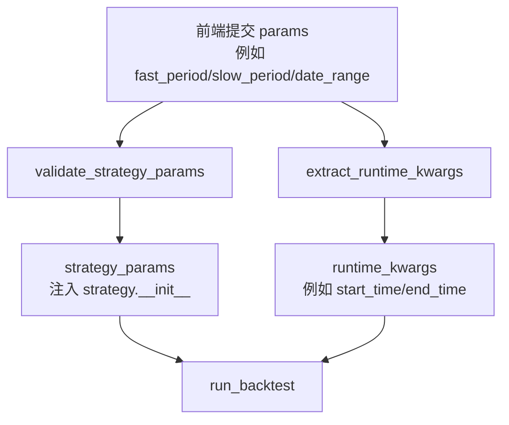

# 示例集合

## 1. 基础示例 (Basic Examples)

*   [Examples 目录索引](https://github.com/akfamily/akquant/blob/main/examples/README.md): 快速浏览 `examples/` 下所有脚本入口，并包含按场景整理的最短执行路径。
*   [快速开始 (Quickstart)](../start/quickstart.md): 包含手动数据回测和 AKShare 数据回测的完整流程。
*   [简单的均线策略 (SMA Strategy)](strategy.md#class-based): 展示了如何使用类风格编写策略，并在 `on_bar` 中进行简单的交易逻辑。
*   [多标的目标权重调仓最短路径](https://github.com/akfamily/akquant/blob/main/examples/43_target_weights_rebalance.py): TopN 动态调仓示例，展示同时间切片收齐后基于动量的组合再平衡。
*   [指标组合 Playbook 示例](https://github.com/akfamily/akquant/blob/main/examples/45_talib_indicator_playbook_demo.py): 演示 `EMA/ADX/NATR` 与 `BBANDS/RSI/MOM` 组合在同一策略中的落地方式，并支持 `--data-source akshare` 真实数据模式。

> 数据源约定：除特别标注需要模拟数据外，本页示例默认使用 AKShare 获取真实市场数据。

### 页面化参数配置（PARAM_MODEL）

在 Web UI / API 场景中，建议在策略中声明参数模型，并将优化搜索空间保持为独立的 `param_grid`：

```python
from akquant import (
    IntParam,
    ParamModel,
    Strategy,
    get_strategy_param_schema,
    validate_strategy_params,
    run_grid_search,
)


class SmaParams(ParamModel):
    fast_period: int = IntParam(10, ge=2, le=200)
    slow_period: int = IntParam(30, ge=3, le=500)


class SmaStrategy(Strategy):
    PARAM_MODEL = SmaParams

    def __init__(self, fast_period: int = 10, slow_period: int = 30):
        self.fast_period = fast_period
        self.slow_period = slow_period


schema = get_strategy_param_schema(SmaStrategy)
validated = validate_strategy_params(
    SmaStrategy,
    {"fast_period": 12, "slow_period": 36},
)

results = run_grid_search(
    strategy=SmaStrategy,
    data=df,
    param_grid={"fast_period": [5, 10, 15], "slow_period": [20, 30, 60]},
)
```

### 参数分流流程图（前端 params -> 回测调用）



说明：

* `strategy_params` 负责策略构造参数（策略逻辑相关，如均线周期）。
* `runtime_kwargs` 负责回测运行参数（回测窗口/运行环境相关，如 `start_time`、`end_time`）。
* 当前默认映射规则是 `date_range -> start_time/end_time`。

### 接口联调示例（HTTP）

1) 获取参数 schema（前端用于自动渲染表单）：

```http
GET /api/strategies/sma_cross/schema
```

示例响应：

```json
{
  "title": "SMACrossParams",
  "type": "object",
  "properties": {
    "fast_period": { "type": "integer", "default": 10, "minimum": 2, "maximum": 200 },
    "slow_period": { "type": "integer", "default": 30, "minimum": 3, "maximum": 500 },
    "date_range": {
      "type": "object",
      "properties": {
        "start": { "type": "string", "format": "date-time" },
        "end": { "type": "string", "format": "date-time" }
      }
    }
  }
}
```

2) 提交参数并启动回测：

```http
POST /api/backtest
Content-Type: application/json
```

```json
{
  "strategy_id": "sma_cross",
  "params": {
    "fast_period": 12,
    "slow_period": 36,
    "date_range": {
      "start": "2023-01-01T00:00:00",
      "end": "2023-12-31T00:00:00"
    }
  }
}
```

示例响应（展示参数分流结果）：

```json
{
  "strategy_params": {
    "fast_period": 12,
    "slow_period": 36,
    "date_range": {
      "start": "2023-01-01T00:00:00",
      "end": "2023-12-31T00:00:00"
    }
  },
  "runtime_kwargs": {
    "start_time": "2023-01-01T00:00:00",
    "end_time": "2023-12-31T00:00:00"
  }
}
```

## 2. 进阶示例 (Advanced Examples)

*   **Zipline 风格策略**: 展示了如何使用函数式 API (`initialize`, `on_bar`) 编写策略，适合从 Zipline 迁移的用户。
    *   参考 [策略指南](strategy.md#style-selection)。

*   **多品种回测 (Multi-Asset)**:
    *   **期货策略**: 展示期货回测配置（保证金、乘数）。参考 [策略指南](strategy.md)。
    *   **期权策略**: 展示期权回测配置（权利金、按张收费）。参考 [策略指南](strategy.md)。

*   **向量化指标 (Vectorized Indicators)**:
    *   展示如何使用 `IndicatorSet` 预计算指标以提高回测速度。参考 [策略指南](strategy.md)。

### 使用 AKShare 获取 A 股日线数据 (stock_zh_a_daily)

```python
import akshare as ak
import pandas as pd
from akquant import run_backtest

df = ak.stock_zh_a_daily(symbol="sz000001", adjust="qfq")
if "date" not in df.columns:
    df = df.reset_index().rename(columns={"index": "date"})
df.columns = [c.lower() for c in df.columns]
if "time" in df.columns and "date" not in df.columns:
    df = df.rename(columns={"time": "date"})
df["date"] = pd.to_datetime(df["date"]).dt.tz_localize("Asia/Shanghai")
df["symbol"] = "000001"
cols = ["date", "open", "high", "low", "close", "volume", "symbol"]
df = df[cols].sort_values("date").reset_index(drop=True)

# result = run_backtest(data=df, strategy=DualSMAStrategy, lot_size=100)
```

## 3. 常用策略示例 (Common Strategies)

以下是一些常用量化策略的实现代码，可以直接在您的项目中使用。我们为每个策略提供了详细的逻辑说明，帮助您理解其核心思想。

### 3.1 A股双均线策略 (Dual Moving Average)

[查看完整源码](https://github.com/akfamily/akquant/blob/main/examples/strategies/01_stock_dual_moving_average.py)

**核心概念**:
利用长短两条均线的交叉来判断趋势。

- **金叉 (Golden Cross)**: 短期均线上穿长期均线，买入信号。
- **死叉 (Death Cross)**: 短期均线下穿长期均线，卖出信号。

**AKQuant 特性演示**:

- 使用 `get_history` 获取历史数据（包含当前 Bar）。
- A股交易规则（1手=100股）。

```python
class DualMovingAverageStrategy(Strategy):
    def __init__(self, short_window=5, long_window=20):
        self.short_window = short_window
        self.long_window = long_window
        # 预热期设置
        self.warmup_period = long_window

    def on_bar(self, bar):
        # 获取包含当前 Bar 的历史数据
        closes = self.get_history(count=self.long_window, symbol=bar.symbol, field="close")

        if len(closes) < self.long_window:
            return

        # 计算均线
        short_ma = np.mean(closes[-self.short_window:])
        long_ma = np.mean(closes[-self.long_window:])

        current_pos = self.get_position(bar.symbol)

        # 金叉买入
        if short_ma > long_ma and current_pos == 0:
            self.order_target_percent(symbol=bar.symbol, target_percent=0.95)

        # 死叉卖出
        elif short_ma < long_ma and current_pos > 0:
            self.close_position(symbol=bar.symbol)
```

### 3.2 股票网格交易 (Grid Trading)

[查看完整源码](https://github.com/akfamily/akquant/blob/main/examples/strategies/02_stock_grid_trading.py)

**核心概念**:
一种基于价格波动的机械式交易策略。

- **下跌加仓**: 价格每下跌一定比例，买入一份。
- **上涨减仓**: 价格每上涨一定比例，卖出一份。
- **适合震荡市**: 在价格反复震荡中通过高抛低吸获利。

**AKQuant 特性演示**:

- 在 `on_bar` 中维护自定义状态变量 (`self.last_trade_price`)。
- 复杂持仓管理。

```python
class GridTradingStrategy(Strategy):
    def __init__(self, grid_pct=0.03, lot_size=100):
        self.grid_pct = grid_pct
        self.trade_lot = lot_size
        self.last_trade_price = {}

    def on_bar(self, bar):
        symbol = bar.symbol
        close = bar.close

        # 初始建仓
        if symbol not in self.last_trade_price:
            self.buy(symbol=symbol, quantity=10 * self.trade_lot)
            self.last_trade_price[symbol] = close
            return

        last_price = self.last_trade_price[symbol]
        change_pct = (close - last_price) / last_price

        # 下跌网格买入
        if change_pct <= -self.grid_pct:
            self.buy(symbol=symbol, quantity=self.trade_lot)
            self.last_trade_price[symbol] = close

        # 上涨网格卖出
        elif change_pct >= self.grid_pct:
            current_pos = self.get_position(symbol)
            if current_pos >= self.trade_lot:
                self.sell(symbol=symbol, quantity=self.trade_lot)
                self.last_trade_price[symbol] = close
```

### 3.3 ATR 通道突破策略 (ATR Breakout)

[查看完整源码](https://github.com/akfamily/akquant/blob/main/examples/strategies/03_stock_atr_breakout.py)

**核心概念**:
利用 ATR (平均真实波幅) 构建价格通道，捕捉趋势突破。

- **上轨**: 昨日收盘价 + k * ATR
- **下轨**: 昨日收盘价 - k * ATR
- **突破买入**: 价格突破上轨。
- **跌破卖出**: 价格跌破下轨。

**AKQuant 特性演示**:

- **避免未来函数**: 使用 `get_history` 获取数据后，通过切片 `[:-1]` 剔除当前 Bar，仅使用历史数据计算今日的突破阈值。

```python
class AtrBreakoutStrategy(Strategy):
    def __init__(self, period=20, k=2.0):
        self.period = period
        self.k = k
        self.warmup_period = period + 1

    def on_bar(self, bar):
        # 获取 N+1 个数据
        req_count = self.period + 1
        h_closes = self.get_history(count=req_count, field="close")

        if len(h_closes) < req_count:
            return

        # 剔除当前 Bar (最后一个数据)，仅使用历史数据计算指标
        closes = h_closes[:-1]

        # ... (ATR 计算逻辑) ...
        atr = calculate_atr(closes) # 伪代码

        # 基于昨日收盘价计算轨道
        prev_close = closes[-1]
        upper_band = prev_close + self.k * atr
        lower_band = prev_close - self.k * atr

        # 交易逻辑
        if bar.close > upper_band:
            self.buy(quantity=500)
        elif bar.close < lower_band:
            self.close_position()
```

[查看完整源码](https://github.com/akfamily/akquant/blob/main/examples/strategies/04_stock_momentum_rotation.py)

### 3.4 多股票动量轮动 (Momentum Rotation)

**核心概念**:
在多只标的之间，持有近期动量（收益率）最强的那一只。

- 定期（如每日）计算候选标的的动量。
- 卖出弱势标的，全仓买入最强标的。

**AKQuant 特性演示**:

- **多标的数据**: 传入 `Dict[str, DataFrame]` 给回测引擎。
- **跨标的比较**: 在策略中遍历 `self.symbols`，分别调用 `get_history`。
- **目标仓位管理**: 使用 `order_target_percent` 方便地进行换仓。

```python
class MomentumRotationStrategy(Strategy):
    def __init__(self, lookback_period=20):
        self.lookback_period = lookback_period
        self.symbols = ["sh600519", "sz000858"] # 茅台 vs 五粮液
        self.warmup_period = lookback_period + 1

    def on_bar(self, bar):
        # 仅在处理最后一个标的时执行轮动逻辑 (每日一次)
        if bar.symbol != self.symbols[-1]:
            return

        # 1. 计算动量
        momentums = {}
        for s in self.symbols:
            closes = self.get_history(count=self.lookback_period, symbol=s, field="close")
            # 动量 = (当前价 - N天前价格) / N天前价格
            mom = (closes[-1] - closes[0]) / closes[0]
            momentums[s] = mom

        # 2. 选出最强
        best_symbol = max(momentums, key=momentums.get)

        # 3. 换仓
        current_pos_symbol = self.get_current_holding_symbol() # 伪代码

        if current_pos_symbol != best_symbol:
            if current_pos_symbol:
                self.close_position(current_pos_symbol)
            # 目标仓位 95%
            self.order_target_percent(target_percent=0.95, symbol=best_symbol)
```

### 3.5 使用后复权序列作信号，真实价格撮合

当数据包含 `adj_close` 或 `adj_factor` 时，可直接通过 `get_history(symbol=..., field="adj_close", n)` 获取后复权序列用于信号计算，而撮合与估值仍使用真实收盘价 `close`。示例见仓库 `examples/16_adj_returns_signal.py`。

```python
class AdjSignal(Strategy):
    warmup_period = 5
    def on_bar(self, bar):
        try:
            x = self.get_history(2, bar.symbol, "adj_close")
        except Exception:
            return
        if x is None or len(x) < 2:
            return
        r = x[-1] / x[-2] - 1.0
        pos = self.get_position(bar.symbol)
        if pos == 0 and r > 0:
            self.buy(bar.symbol, 100)
        elif pos > 0 and r < 0:
            self.close_position(bar.symbol)
```

## 4. 更多 AKShare 示例

`examples/` 目录下还包含更多演示 AKShare 集成的脚本：

*   **[11_plot_visualization.py](https://github.com/akfamily/akquant/blob/main/examples/11_plot_visualization.py)**:
    *   完整流程：获取数据 -> 运行回测 -> 生成可视化报告。
    *   演示如何生成专业的 HTML 交互式报告。

*   **[14_multi_frequency.py](https://github.com/akfamily/akquant/blob/main/examples/14_multi_frequency.py)**:
    *   **混合频率 (Mixed Frequency)**: 结合日线数据（用于趋势判断）和分钟线数据（用于执行）。
    *   注：为了演示方便，该示例基于 AKShare 的日线数据合成了分钟线数据。

*   **[15_plot_intraday.py](https://github.com/akfamily/akquant/blob/main/examples/15_plot_intraday.py)**:
    *   **日内模拟 (Intraday Simulation)**: 基于 AKShare 日线数据生成合成的分钟级数据。
    *   演示高频回测能力。

*   **[17_readme_demo.py](https://github.com/akfamily/akquant/blob/main/examples/17_readme_demo.py)**:
    *   README 中的演示脚本，是一个简单的独立文件。
    *   适合作为 "Hello World" 快速测试。

*   **[22_strategy_runtime_config_demo.py](https://github.com/akfamily/akquant/blob/main/examples/22_strategy_runtime_config_demo.py)**:
    *   演示 `strategy_runtime_config`、`runtime_config_override` 与热启动注入。
    *   展示同一策略实例重复运行时的冲突告警去重效果。
    *   预期输出标记包括 `scenario1_done`、`scenario2_exception=...`、`scenario3_done`。

*   **[23_functional_callbacks_demo.py](https://github.com/akfamily/akquant/blob/main/examples/23_functional_callbacks_demo.py)**:
    *   演示函数式回调接口：`initialize`、`on_bar`，以及可选 `on_order` / `on_trade` / `on_timer`。
    *   输出回调计数，并以 `done_functional_callbacks_demo` 作为结束标记。

*   **[24_functional_tick_simulation_demo.py](https://github.com/akfamily/akquant/blob/main/examples/24_functional_tick_simulation_demo.py)**:
    *   演示函数式 `on_tick` 回调在模拟 Tick 事件分发下的触发方式。
    *   输出 tick/order/trade/timer 计数，并以 `done_functional_tick_simulation_demo` 作为结束标记。

*   **[25_streaming_backtest_demo.py](https://github.com/akfamily/akquant/blob/main/examples/25_streaming_backtest_demo.py)**:
    *   演示 `run_backtest(..., on_event=...)` 在 `stream_error_mode="continue"` 与 `"fail_fast"` 两种模式下的行为差异。
    *   输出 `continue_callback_error_count`、`fail_fast_exception=...`，并以 `done_streaming_backtest_demo` 作为结束标记。

*   **[26_streaming_quickstart.py](https://github.com/akfamily/akquant/blob/main/examples/26_streaming_quickstart.py)**:
    *   提供一个与 `01_quickstart.py` 同风格的流式版本，使用 `run_backtest(..., on_event=...)` 接收事件。
    *   输出 `stream_started`、`stream_finished`、`stream_seq_monotonic` 等摘要，并以 `done_streaming_quickstart` 作为结束标记。

*   **[27_streaming_monitoring_console.py](https://github.com/akfamily/akquant/blob/main/examples/27_streaming_monitoring_console.py)**:
    *   演示参数组合回测时的实时监控控制台输出，基于 `run_backtest(..., on_event=...)` 统计 `progress/order/trade/finished` 事件。
    *   输出每组参数的事件计数与收益摘要，并以 `done_streaming_monitoring_console` 作为结束标记。

*   **[28_streaming_alerts_and_persist.py](https://github.com/akfamily/akquant/blob/main/examples/28_streaming_alerts_and_persist.py)**:
    *   演示流式事件告警与落盘：在 `equity` 事件上计算回撤并触发阈值告警，同时将事件快照保存为 CSV。
    *   输出 `max_drawdown_seen`、`event_csv=...`，并以 `done_streaming_alerts_and_persist` 作为结束标记。

*   **[29_streaming_event_report.py](https://github.com/akfamily/akquant/blob/main/examples/29_streaming_event_report.py)**:
    *   读取 `28_streaming_alerts_and_persist.py` 生成的 CSV，输出交互式 HTML 报告（累计事件曲线 + 事件分布）。
    *   输出 `report_html=...`，并以 `done_streaming_event_report` 作为结束标记。

*   **[30_streaming_report_oneclick.py](https://github.com/akfamily/akquant/blob/main/examples/30_streaming_report_oneclick.py)**:
    *   一键串联 28 与 29：先生成事件 CSV，再生成 HTML 报告，并可自动打开浏览器。
    *   支持 `--no-open`、`--serve`、`--port`、`--serve-seconds` 参数，输出 `done_streaming_report_oneclick` 作为结束标记。

*   **[31_streaming_live_console.py](https://github.com/akfamily/akquant/blob/main/examples/31_streaming_live_console.py)**:
    *   演示“边回测边看效果”：在 `equity` 事件上实时输出终端 sparkline 图形，并在回撤超过阈值时打印告警消息。
    *   输出 `total_return`、`max_drawdown_live`，并以 `done_streaming_live_console` 作为结束标记。

*   **[32_streaming_live_web.py](https://github.com/akfamily/akquant/blob/main/examples/32_streaming_live_web.py)**:
    *   演示“肉眼可见”的网页实时回测：浏览器轮询流式状态并动态绘制权益曲线，同时显示告警与进度。
    *   支持 `--port`、`--open`、`--sleep-ms`、`--keep-seconds` 参数，并以 `done_streaming_live_web` 作为结束标记。

*   **[33_report_and_analysis_outputs.py](https://github.com/akfamily/akquant/blob/main/examples/33_report_and_analysis_outputs.py)**:
    *   演示回测后的一站式产出：生成交互式报告，并输出 `exposure_df` / `attribution_df` / `capacity_df` 以及按策略归属聚合 `orders_by_strategy` / `executions_by_strategy` 的行数摘要。
    *   输出 `report_html=...`，并以 `done_report_and_analysis_outputs` 作为结束标记。

*   **[34_multi_strategy_demo.py](https://github.com/akfamily/akquant/blob/main/examples/34_multi_strategy_demo.py)**:
    *   演示多策略 slot 组织方式，采用集中式 `BacktestConfig(strategy_config=StrategyConfig(...))` 写法。
    *   覆盖策略级限额、仅平仓、冷却 bars 等配置驱动能力。
    *   输出 `single_owner_ids`、`multi_owner_ids`、`multi_alpha_cooldown_rejections` 等摘要，并以 `done_multi_strategy_demo` 作为结束标记。

*   **[35_custom_broker_registry_demo.py](https://github.com/akfamily/akquant/blob/main/examples/35_custom_broker_registry_demo.py)**:
    *   演示自定义 broker 注册机制：通过 `register_broker` 注入 `builder` 并使用 `create_gateway_bundle` 按名称创建网关。
    *   输出 `bundle.metadata` 以确认自定义 broker 已被工厂解析。

*   **[43_target_weights_rebalance.py](https://github.com/akfamily/akquant/blob/main/examples/43_target_weights_rebalance.py)**:
    *   演示 TopN 动态权重调仓：先按动量打分选强势标的，再通过 `order_target_weights` 一次性完成组合再平衡。
    *   展示 `liquidate_unmentioned` 与 `rebalance_tolerance` 的组合用法，并输出 `selected_history` / `final_positions` / `final_equity`。
