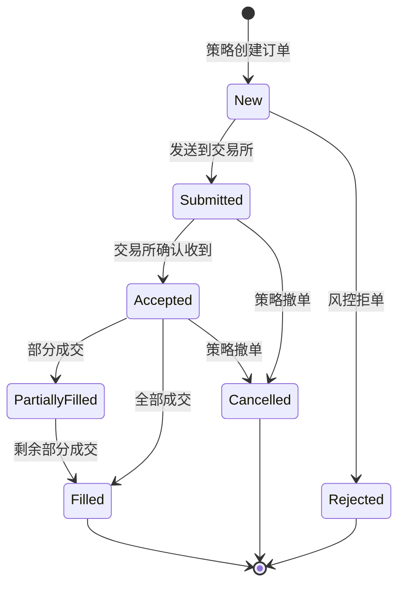

# 第 4 章：事件驱动回测原理 (Event-Driven Architecture)

在第 1 章中，我们运行了一个简单的策略；在第 3 章中，我们准备好了数据。现在，让我们揭开 `akquant` 引擎盖下的秘密，从软件工程的角度深入理解**事件驱动 (Event-Driven)** 架构的设计原理。

## 4.1 回测系统的两种范式

量化回测系统主要分为两大类：**向量化回测 (Vectorized Backtesting)** 和 **事件驱动回测 (Event-Driven Backtesting)**。

为了直观理解这两种模式的区别，我们编写了一个对比脚本 `examples/textbook/ch04_comparison.py`，分别使用 **Pandas** (向量化)、**Backtrader** (Python 事件驱动) 和 **AKQuant** (Rust 事件驱动) 实现了同一个双均线策略。

### 4.1.1 向量化回测 (Pandas)

向量化回测利用 Pandas/NumPy 的矩阵运算能力，一次性计算出所有时间点的信号。这在数学上等同于对整个时间序列矩阵进行线性代数变换。

```python
# Pandas 向量化回测核心逻辑 (节选自 examples/textbook/ch04_comparison.py)
def run_pandas_backtest(df):
    # 1. 计算指标 (一次性计算整列)
    df['ma5'] = df['close'].rolling(5).mean()
    df['ma20'] = df['close'].rolling(20).mean()

    # 2. 生成信号 (使用 np.where 全量生成)
    # 核心：必须使用 shift(1) 将信号后移一天，避免前视偏差 (Look-ahead Bias)
    df['signal'] = np.where(df['ma5'] > df['ma20'], 1, 0)
    df['position'] = df['signal'].shift(1)

    # 3. 计算收益
    df['strategy_return'] = df['position'] * df['close'].pct_change()
```

*   **优点**：代码极简，计算效率极高（通常是毫秒级），适合早期的 Idea 验证。
*   **缺点**：
    *   **前视偏差风险**：极易引入未来函数（如忘记 `shift(1)`）。
    *   **路径依赖缺失**：难以模拟撮合机制、滑点、资金占用等与“交易路径”强相关的状态。

### 4.1.2 事件驱动回测 (Backtrader & AKQuant)

事件驱动回测模拟了真实世界的时间流逝。它本质上是一个**无限循环 (Event Loop)**，不断地从队列中取出事件并处理。

**状态机 (State Machine)** 模型：

$$ State_{t+1} = f(State_t, Event_t) $$

其中 $State$ 包含账户资金、持仓、挂单等，$Event$ 包含行情更新、订单成交等。

**Backtrader (Python 经典框架)**：

```python
# Backtrader 策略逻辑 (节选)
class SmaCross(bt.Strategy):
    def next(self):
        # 每个时间步都会调用一次 next()
        if not self.position:
            if self.crossover > 0:
                self.buy() # 发出买单，将在下一根 Bar 成交
```

**AKQuant (Rust 高性能框架)**：

```python
# AKQuant 策略逻辑 (节选)
class AKQuantSmaStrategy(Strategy):
    def on_bar(self, bar: Bar):
        # 也是逐个 Bar 处理
        # 区别在于 AKQuant 底层循环由 Rust 实现，速度远快于 Python
        ma5 = ...
        if ma5 > ma20 and pos == 0:
            self.order_target_percent(...)
```

*   **优点**：
    *   **零未来函数**：在处理当前 Bar 时，物理上无法访问下一个 Bar 的数据。
    *   **高度仿真**：支持限价单、止损单、复杂资金管理等微观结构模拟。
*   **性能对比**：
    *   Backtrader 由于使用 Python 循环，在数据量大时存在 GIL 锁限制，速度较慢。
    *   AKQuant 利用 Rust 的无 GC 特性和零成本抽象，在保持事件驱动精确性的同时，性能接近向量化回测。

你可以运行以下命令亲自体验三者的差异：

```bash
python examples/textbook/ch04_comparison.py
```

## 4.2 AKQuant 架构深度解析 (Architecture Deep Dive)

`akquant` 采用了一种独特的**混合架构 (Hybrid Architecture)**，旨在结合 Python 的易用性和 Rust 的高性能。

### 4.2.1 核心设计理念：Rust Core + Python API

整个系统分为两个清晰的层级：

1.  **Rust Core (核心层)**：负责所有计算密集型任务。
    *   **Engine**: 维护全局状态、资金、持仓、订单簿。
    *   **DataFeed**: 高效的数据流管理。
    *   **Matching Engine**: 订单撮合逻辑。
    *   **Risk Manager**: 实时风控检查。
2.  **Python API (应用层)**：负责用户交互和策略逻辑。
    *   **Strategy**: 用户编写策略的基类。
    *   **Indicator**: 技术指标计算。
    *   **Plotting**: 结果可视化。

100→这两层通过 **PyO3** 进行零开销绑定。当你在 Python 中调用 `self.buy()` 时，实际上直接触发了 Rust 层的函数调用，没有任何中间序列化成本。

## 4.3 撮合引擎揭秘 (Matching Engine Internals)

回测引擎的核心在于**撮合 (Matching)**：如何根据历史行情判断你的订单是否成交，以及以什么价格成交。

### 4.3.1 基于 Bar 的撮合逻辑

在没有 Tick 数据的情况下，我们通常使用 OHLCV 数据进行近似撮合。假设当前 Bar 的数据为 $(O, H, L, C, V)$。

1.  **市价单 (Market Order)**：
    *   **买入**：以 $Open$ 价（或 $Close$ 价，取决于策略是在开盘还是收盘下单）成交。
    *   **滑点**：通常在成交价基础上增加 $N$ 个跳 (Tick Size)。

2.  **限价单 (Limit Order)**：假设买入限价为 $P_{limit}$。
    *   **完全成交**：如果 $Low < P_{limit}$，说明盘中价格跌破了限价，订单必然成交。
    *   **无法成交**：如果 $Low > P_{limit}$，说明盘中最低价都高于限价，订单无法成交。
    *   **部分成交**：如果 $Low = P_{limit}$，情况比较复杂。通常保守起见，假设只有部分成交或不成交。

3.  **止损单 (Stop Order)**：假设卖出止损价为 $P_{stop}$。
    *   **触发**：如果 $Low < P_{stop}$，止损被触发，转为市价单卖出。
    *   **成交价**：通常取 $P_{stop}$ 或 $Low$ 中的较差者（模拟跳空低开的情况）。

### 4.3.2 涨跌停处理

在 A 股市场，涨跌停板会锁死流动性。

*   **涨停 (Limit Up)**：$High = LimitUp$。此时**买入**市价单无法成交，买入限价单也无法成交（除非排队在前）。
*   **跌停 (Limit Down)**：$Low = LimitDown$。此时**卖出**订单无法成交。

`akquant` 引擎在撮合时会严格检查涨跌停状态，避免在涨停板上买入或跌停板上卖出。

## 4.4 滑点与冲击成本模型 (Slippage & Impact Models)

真实交易中，你的买入行为会推高价格，卖出行为会压低价格。这种**冲击成本 (Market Impact)** 是大资金回测必须考虑的。

### 4.4.1 线性滑点模型

最简单的模型，假设滑点与交易量无关。

$$ P_{fill} = P_{market} \pm \text{Slippage} $$

其中 $\text{Slippage}$ 可以是固定值（如 0.01 元）或百分比（如 0.1%）。

### 4.4.2 平方根法则 (Square Root Law)

这是学术界和业界公认的冲击成本模型，由 Barra 提出。

$$ \text{Cost} \propto \sigma \times \sqrt{\frac{Q}{V}} $$

其中：

- $\sigma$：资产的波动率。
- $Q$：你的交易量。
- $V$：市场的总成交量。

这表明：**冲击成本与交易量的平方根成正比**。如果你想把交易量翻倍，冲击成本只会增加 $\sqrt{2} \approx 1.414$ 倍，而不是 2 倍。这为大资金拆单提供了理论依据。

## 4.5 事件循环伪代码 (Event Loop Pseudo-code)

为了更清晰地理解 `akquant` 的运行机制，我们可以用伪代码描述其主循环：

```python
def run_backtest():
    # 1. 初始化
    engine = Engine()
    strategy = UserStrategy()
    data_feed = DataFeed(start_date, end_date)

    # 2. 事件循环 (Event Loop)
    while not data_feed.is_finished():
        # 2.1 获取下一个事件 (通常是 Bar)
        event = data_feed.next()

        # 2.2 更新时间
        engine.current_time = event.datetime

        # 2.3 撮合挂单 (Matching)
        # 检查之前的限价单/止损单是否能在当前 Bar 成交
        engine.match_orders(event)

        # 2.4 策略逻辑 (Strategy)
        # 调用用户的 on_bar 函数
        strategy.on_bar(event)

        # 2.5 结算 (Settlement)
        # 如果是日终，进行每日结算 (Mark-to-Market)
        if event.is_eod:
            engine.settle()

    # 3. 生成报告
    engine.generate_report()
```

这个循环确保了**时间流逝的单向性**，杜绝了未来函数。

---

**本章小结**：

### 4.2.2 系统组件图

```mermaid
graph TD
    subgraph "Python Layer (Strategy & Data)"
        UserStrategy[用户策略 Strategy]
        PyData[Pandas DataFrame]
    end

    subgraph "Rust Layer (High Performance Core)"
        Engine[Engine (引擎核心)]
        DataFeed[DataFeed (数据源)]
        Portfolio[Portfolio (账户状态)]
        OrderBook[OrderBook (订单簿)]
        RiskManager[RiskManager (风控)]
    end

    PyData -->|转换 & 加载| DataFeed
    DataFeed -->|Bar/Tick Event| Engine
    Engine -->|Context Update| UserStrategy
    UserStrategy -->|Order Request| Engine
    Engine -->|Order Check| RiskManager
    RiskManager -->|Approved| OrderBook
    OrderBook -->|Fill Event| Portfolio
    Portfolio -->|Update| UserStrategy
```

### 4.2.3 关键组件详解

#### 1. Engine (引擎)
引擎是系统的调度中心 (Dispatcher)。它维护着全局时钟 (Global Clock) 和事件优先队列 (Priority Queue)。在 `akquant` 中，`Engine` 是一个 Rust 结构体，它完全接管了 Python 的控制流。

*   **职责**：推进时间、分发事件、触发回调。
*   **特性**：单线程极速循环，避免了 Python GIL 的锁竞争。

#### 2. DataFeed (数据源)
负责按时间顺序向引擎“滴灌”行情数据。

*   **实现**：在 Rust 中，`DataFeed` 内部维护了一个时间排序的 B-Tree 或 Vec，确保数据严格按时间戳推送。
*   **多标的同步**：当回测多个标的时，DataFeed 会自动对齐时间，确保 `on_bar` 接收到的数据在时间轴上是同步的。

#### 3. StrategyContext (策略上下文)
这是 Python 策略与 Rust 引擎通信的桥梁。

*   **数据共享**：`StrategyContext` 在 Rust 中持有对 Portfolio 和 Orders 的引用，并通过 PyO3 暴露给 Python。
*   **零拷贝访问**：当你访问 `self.ctx.positions` 时，你实际上是直接读取 Rust 的内存，没有数据复制。

## 4.3 订单生命周期与状态机 (Order Lifecycle)

在事件驱动系统中，理解订单的状态流转至关重要。一个订单从产生到最终成交，会经历严格的状态机变换。



### 4.3.1 关键状态解析

1.  **New (新建)**:
    *   策略调用 `self.buy()` 后，订单对象被创建，但在风控检查通过前，状态为 `New`。
    *   此时订单尚未进入撮合队列。

2.  **Submitted (已提交)**:
    *   订单通过了客户端风控（如资金检查），已发送到交易所（或模拟撮合引擎）。
    *   在实盘中，这代表网络请求已发出。

3.  **Accepted (已受理)**:
    *   交易所确认收到订单。在 `akquant` 的回测模式中，通常 `Submitted` 后立即转为 `Accepted`（除非模拟了网络延迟）。

4.  **Filled (全部成交)**:
    *   订单的所有数量都已成交。此时会触发 `on_trade` 回调，并且持仓和资金会相应更新。

5.  **Rejected (已拒绝)**:
    *   订单因某些原因被拒绝。常见原因：
        *   **资金不足 (Insufficient Margin)**: 可用资金不足以支付保证金或全额。
        *   **非法数量 (Invalid Quantity)**: 例如 A 股买入必须是 100 的整数倍。
        *   **废单**: 价格超过涨跌停板。

## 4.4 撮合引擎机制 (Matching Engine Mechanics)

`akquant` 的模拟撮合引擎 (`SimulatedExecutionClient`) 旨在尽可能逼真地模拟真实交易所的撮合逻辑。

### 4.4.1 撮合逻辑 (Matching Logic)

对于每一根新的 Bar (或 Tick)，引擎会遍历所有活跃订单进行撮合：

1.  **市价单 (Market Order)**:
    *   **成交价**: 取决于 `ExecutionMode`（见下文）。
    *   **成交量**: 尽可能全部成交，除非受限于当根 Bar 的成交量（Volume Limit）。

2.  **限价单 (Limit Order)**:
    *   **买入单**: 当 `Low Price <= Limit Price` 时成交。
        *   *价格优化*: 如果 `Open Price < Limit Price`，则以 `Open Price` 成交（模拟开盘撮合）。
    *   **卖出单**: 当 `High Price >= Limit Price` 时成交。
    *   **成交价**: 也就是常说的“价格优先”。

3.  **止损单 (Stop Order)**:
    *   当市场价格突破触发价 (`Trigger Price`) 时，止损单会转化为市价单或限价单。
    *   `akquant` 支持**穿透检查 (Gap Detection)**：例如，昨日收盘 100，今日跳空低开 90，如果你有 95 的止损卖单，引擎会正确地在 90 成交（而不是 95），真实模拟跳空风险。

### 4.4.2 撮合模式 (Execution Mode)

为了平衡回测的严谨性和灵活性，`akquant` 提供了多种撮合模式：

| 模式 | 描述 | 适用场景 | 备注 |
| :--- | :--- | :--- | :--- |
| **NextOpen** (默认) | 当前 Bar 的信号，在**下一根 Bar 的开盘价**成交。 | 日线/分钟线策略 | **最推荐**。完全避免未来函数。 |
| **CurrentClose** | 当前 Bar 的信号，在**当前 Bar 的收盘价**成交。 | 收盘竞价策略 | 需小心使用，容易引入前视偏差。 |
| **NextAverage** | 在下一根 Bar 的均价成交。 | 大资金VWAP模拟 | 均价 = (O+H+L+C)/4 |

### 4.4.3 滑点与冲击成本 (Slippage & Impact)

回测中最容易高估收益的因素是忽略了交易成本。`akquant` 支持配置滑点模型：

$$ \text{Final Price} = \text{Execution Price} \times (1 \pm \text{Slippage Rate}) $$

*   **买入**: 价格向上滑动（买得更贵）。
*   **卖出**: 价格向下滑动（卖得更便宜）。

此外，你还可以设置 **Volume Limit**（例如 10%），限制策略在单根 Bar 上的成交量不超过市场总成交量的 10%，以模拟流动性限制。

## 4.5 资金与风控管理 (Portfolio & Risk)

### 4.5.1 资金校验 (Pre-trade Check)

在订单提交前，Rust 层的 `RiskManager` 会进行严格的资金校验：

1.  **计算成本**:
    *   股票: `Price * Quantity`
    *   期货: `Price * Quantity * Multiplier * MarginRatio`
2.  **计算费用**: 预估佣金、印花税等。
3.  **比较**: `Total Cost > Free Cash` ?
    *   如果资金不足，订单会被**自动拒绝 (Rejected)**，或者根据配置**自动缩减数量 (Auto-resize)** 以适应剩余资金。

### 4.5.2 T+1 制度模拟

对于 A 股市场，`akquant` 内置了 T+1 规则支持：

*   **可用持仓 (Available Position)**: 当日买入的股票，在当日的 `available_positions` 中为 0，只有到下一个交易日才会释放。
*   **卖出检查**: 卖出时检查 `available_positions` 而非总持仓。

这意味着如果你在 T 日买入，尝试在 T 日卖出，订单会被拒绝，错误信息提示 "Insufficient available position"。

## 4.6 多标的与时间流 (Time Flow & Multi-Asset)

在回测多个标的（例如全市场选股）时，时间的同步至关重要。

`akquant` 的 `DataFeed` 实现了一个**全局优先队列 (Global Priority Queue)**。无论你加载了多少个 CSV 文件或 DataFrame，引擎都会将它们的数据打散并重新排序。

**工作流程**：

1.  加载 AAPL 的数据，放入队列。
2.  加载 MSFT 的数据，放入队列。
3.  `DataFeed.sort()`：对所有事件按时间戳进行全局排序。
4.  **Event Loop**：引擎调用 `feed.next()`，总是返回时间戳最小的那个事件。

这意味着，即使 AAPL 和 MSFT 在同一分钟都有数据，引擎也会按顺序处理它们（虽然逻辑上是同一时刻），确保了多标的策略在任何时刻看到的都是“当时”的全局状态。

## 4.7 盈亏计算原理 (PnL Mathematics)

理解 `akquant` 的盈亏计算逻辑，对于分析策略表现至关重要。

### 4.7.1 浮动盈亏 (Unrealized PnL)

浮动盈亏反映了当前持仓的未结收益。

$$ \text{Unrealized PnL} = (\text{Current Price} - \text{Entry Price}) \times \text{Quantity} \times \text{Multiplier} $$

*   **Entry Price (入场均价)**：采用加权平均法计算。

### 4.7.2 平仓盈亏 (Realized PnL)

当平仓发生时，浮动盈亏转化为平仓盈亏。`akquant` 采用 **FIFO (先进先出)** 原则进行结算。

**示例**：

1.  买入 100 股 @ 10 元。
2.  买入 100 股 @ 12 元。
3.  卖出 100 股 @ 15 元。

**结算**：
卖出的 100 股会优先匹配第一笔 10 元的买单。

$$ \text{Realized PnL} = (15 - 10) \times 100 = 500 $$

剩余持仓：100 股 @ 12 元。

### 4.7.3 总权益 (Total Equity)

$$ \text{Total Equity} = \text{Cash} + \sum (\text{Market Value of Positions}) $$

其中市值计算包含保证金占用（对于期货/期权）。

## 4.8 常见问题排查 (Troubleshooting)

如果你的订单没有成交，请检查以下清单：

1.  **价格未触发**：
    *   限价买单价格必须 `>=` Bar Low。
    *   限价卖单价格必须 `<=` Bar High。
2.  **资金/持仓不足**：
    *   检查日志中是否有 `Order Rejected: Insufficient cash` 或 `Insufficient available position`。
    *   A 股回测请注意 T+1 限制。
3.  **成交量限制**：
    *   如果你设置了 `volume_limit`，而当根 Bar 成交量很小，订单可能只成交一部分或完全不成交。
4.  **最小交易单位 (Lot Size)**：
    *   A 股买入数量必须是 100 的整数倍。
5.  **时间窗口**：
    *   确保数据覆盖了订单产生的时间段。

## 4.9 性能优化与内存管理

`akquant` 之所以快，除了 Rust 本身的高性能外，还做了大量内存优化：

1.  **避免 DataFrame 碎片化**：历史数据在 Rust 中以连续内存块（Vector）存储，而不是 Python 的分散对象。
2.  **按需计算**：指标（Indicator）通常是增量计算的（Streaming），而不是每次重算整个序列。
3.  **对象池 (Object Pooling)**：虽然目前主要通过栈分配优化，但设计上避免了频繁的大对象创建和销毁。

---

**小结**：本章我们深入探讨了 `akquant` 的混合架构。理解了数据如何在 Python 和 Rust 之间流转，以及订单在时间轴上的生命周期，你就能写出更严谨、更高效的策略代码。在下一章，我们将详细讲解如何编写复杂的交易策略。
